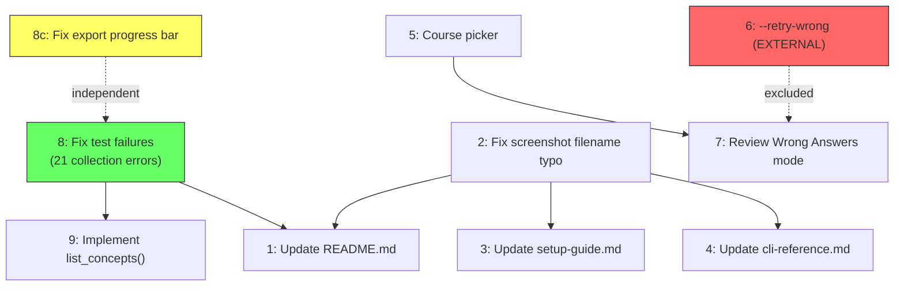
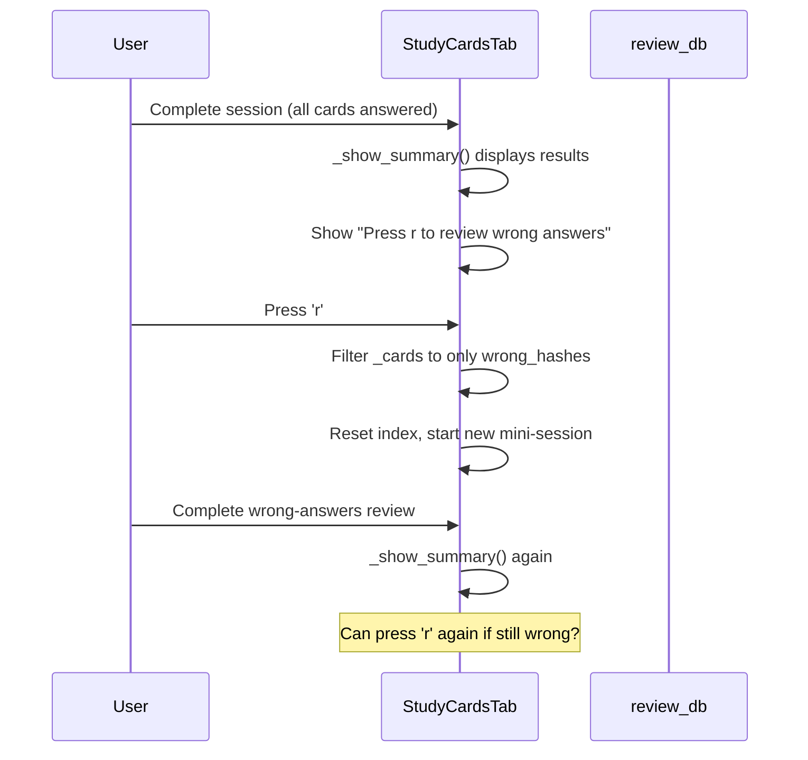

# Phase 9 + Phase 1 Cleanup -- Spec Flow Analysis

**Analyst**: spec-flow-analyzer | **Date**: 2026-03-15 | **Status**: Analysis only, no code

---

## 1. Dependency Graph (Implementation Order)



**Critical path**: Items 8 (tests) and 2 (typo) are prerequisites. Items 5 and 7 are the most complex new features.

---

## 2. Item-by-Item Analysis

### Item 8c (Phase 1 leftover): Export progress bar cumulative stats

**Confirmed bug location**: `packages/agent-session-tools/src/agent_session_tools/export_sessions.py`, inside `_run_export()`.

The progress bar update uses `batch_stats.added` (cumulative) with `source.title()` as label:
```
description=f"{source.title()}: {batch_stats.added} added, {batch_stats.updated} updated"
```
This means when processing Kiro after Claude, it shows "Kiro: 48 added" where 48 includes Claude's count.

**Fix is straightforward**: Use `source_stats` (per-source) instead of `batch_stats` (cumulative) in the progress description. But there is a gap:

- **Gap**: What if `source_stats` is `None` (exporter returned nothing)? The progress description would fail.
- **Gap**: Should the final summary line also show per-source breakdown, or just totals?
- **Gap**: For single-source exports (`--sources claude`), no progress bar is created (`len(sources) > 1` guard). Is this intentional?

### Item 1: Update README.md with TUI section

**Current state**: README exists with CLI Reference section. No TUI section. Screenshot referenced as `images/soctractic_mentor_tui.png` but the actual images/ directory only contains `Socratic_Mentor_Agent.jpg` -- no TUI screenshot exists yet.

**Critical gap**: The screenshot does not exist. The spec says to add a screenshot reference, but the file needs to be captured first. This blocks the README update.

### Item 2: Fix screenshot filename typo

**Moot**: The file `images/soctractic_mentor_tui.png` does not exist on disk. The typo is only in the roadmap text. When the screenshot is eventually taken, just name it correctly from the start: `images/socratic_mentor_tui.png`.

**Recommendation**: This item collapses into Item 1 -- just use the correct filename when creating the screenshot.

### Item 3: Update setup-guide.md with TUI installation

**Straightforward** but depends on Item 2 being resolved. Needs to document:
- `uv pip install 'studyctl[tui]'` or `uv sync --all-packages` with tui extra
- `review.directories` config format in `~/.config/studyctl/config.yaml`
- Key bindings reference

**Gap**: The `[tui]` extra needs to be verified in pyproject.toml. Is it defined? Current studyctl pyproject.toml should be checked for `[project.optional-dependencies]` tui group.

### Item 4: Update cli-reference.md

**Straightforward**. Document `studyctl tui` command. Current CLI reference already lists many commands but not `tui`.

### Item 5: Course Picker for Multiple Directories

**Current behaviour**: `_launch_study()` in `app.py` calls `discover_directories()` and takes `courses[0]` with a TODO comment. The studycards tab displays all courses in a list but always launches the first one.

#### Edge Cases Matrix

| Scenario | Current Behaviour | Expected Behaviour | Gap |
|---|---|---|---|
| 0 courses | Error notification | Same | OK (handled) |
| 1 course | Uses first (only) course | Skip picker, launch directly | Needs spec: skip picker or show it? |
| 2-5 courses | Uses first, ignores rest | Show picker | Core feature |
| 10+ courses | Uses first | Show picker | Scrolling/search needed? |
| Course has flashcards but no quizzes | Mode-dependent | ? | What happens when user picks quiz mode for flashcard-only course? |
| Course has 0 loadable cards (corrupt JSON) | Empty session | ? | Show error or skip course in picker? |
| Config directory no longer exists | Silently skipped by `discover_directories()` | Same | OK |
| Symlinked directories | `Path.is_dir()` follows symlinks | Works | OK |

**Critical questions for course picker**:

1. **UI widget choice**: Textual `Select`, `OptionList`, `RadioSet`, or custom? The TUI already uses `TabbedContent` and `DataTable`. An `OptionList` would be most consistent.
2. **When to show**: Always before launching study, or only when `len(courses) > 1`?
3. **Keyboard navigation**: Arrow keys + Enter? Number keys for quick select?
4. **Remember last choice**: Should the picker default to the last-used course? This would need state persistence.
5. **Course with wrong mode content**: If user presses `f` (flashcards) but selected course only has quizzes, current code shows a notification error. Should the picker filter courses by available mode content?

### Item 6: --retry-wrong flag for pdf-by-chapters review

**EXCLUDE**: This is in an external repo (`notebooklm-pdf-by-chapters`). The spec itself notes "EXTERNAL REPO - may need to exclude." Confirmed: this repo's codebase has no `pdf-by-chapters` code. This item belongs in that repo's backlog.

### Item 7: "Review Wrong Answers" Mode (r key)

**Current state**:
- `StudyCardsTab.BINDINGS` has no `r` key binding
- `_show_summary()` displays wrong count but offers no retry mechanism
- `review_db.get_wrong_hashes()` exists and returns card hashes from the most recent session
- `ReviewResult.wrong_hashes` accumulates incorrect card hashes during a session

#### User Flow (Happy Path)



#### Edge Cases Matrix

| Scenario | Expected Behaviour | Gap |
|---|---|---|
| 0 wrong answers | Hide/disable 'r' option in summary | Not specified |
| All answers wrong | Review entire deck again | Infinite loop risk? Cap retries? |
| User presses 'r' mid-session (not at summary) | Ignore or show "complete session first" | Binding scope unclear |
| Wrong answers review has its own wrong answers | Allow nested retry? | Recursion depth unclear |
| Session was all skipped (0 correct, 0 incorrect) | No wrong answers technically | Should skipped cards be reviewable? |
| User quits mid-wrong-review | Partial results recorded to DB? | State management unclear |
| Voice was enabled in original session | Carry over to wrong review? | Implicit yes, but needs confirmation |

**Critical questions**:

1. **Binding scope**: Should `r` be on `StudyCardsTab` (only visible during study) or `StudyApp` (global)? Since it only makes sense at session completion, it should be on `StudyCardsTab` and only active when summary is displayed.
2. **DB recording**: Should wrong-answer review sessions be recorded as separate `review_sessions` rows, or appended to the original session?
3. **SM-2 impact**: Re-reviewing a wrong card and getting it correct should update the card's ease factor. Current `record_card_review()` handles this, but does `record_session()` handle the supplementary session?
4. **Recursion limit**: If a user keeps getting cards wrong and pressing `r`, is there a cap? Suggest: show `r` option only if `wrong_count > 0` and `wrong_count < total` (to prevent infinite full-deck replay).
5. **Card ordering**: Should wrong answers be re-shuffled or presented in original order?

### Item 8: Fix 29 Pre-existing Test Failures

**ALREADY RESOLVED per MEMORY.md**: "The '29 pre-existing failures' were actually: 18 collection errors (agent-session-tools not installed) + 9 import errors (same cause) + 2 stale assertions. Root cause was single missing `uv sync --all-packages`."

**Current state** (verified just now): `62 tests collected, 21 errors in 0.24s` -- all 21 are collection ERRORs in agent-session-tools and studyctl tests, which is consistent with packages not being installed in the current environment.

**Recommendation**: Remove this item from Phase 9. It was fixed. The 21 collection errors visible now are simply because `uv sync --all-packages` was not run in this environment. Running it would resolve them. This is a dev setup issue, not a code bug.

### Item 9: Implement list_concepts() in history.py

**Current state**: `tui/app.py` line 166 has `# list_concepts not yet implemented -- show empty table` with a `pass` statement. The concepts tab exists with columns "Name", "Domain", "Description" but is always empty.

**Context**: The CLI already has `studyctl concepts list [-d DOMAIN]` and `studyctl concepts add`. This implies a concept graph store exists. The `history.py` module has `record_progress()` which writes to `study_progress` table, and there are concept-related CLI commands.

**Gaps**:
1. **Where does concept data live?** Is it in `sessions.db` or a separate store? The `_populate_concepts()` method needs a data source.
2. **What is the schema?** The table expects Name, Domain, Description -- does the existing concept graph store these fields?
3. **Should it query `study_progress` or a concept graph table?** These are different things -- progress tracks confidence per concept, while a concept graph stores relationships.
4. **Domain filtering**: The CLI has `-d DOMAIN` flag. Should the TUI concepts tab show all domains or have a domain filter?

---

## 3. Missing Elements and Gaps

### Category: Screenshot/Assets

| Gap | Impact | Current State |
|---|---|---|
| TUI screenshot does not exist | Blocks README update (Item 1) | Only `Socratic_Mentor_Agent.jpg` in images/ |
| No process defined for taking screenshot | Manual step easily forgotten | Textual has `app.save_screenshot()` for automation |

### Category: Error Handling

| Gap | Impact | Current State |
|---|---|---|
| Course picker: course with no content for selected mode | User frustration | Current code shows notification, but picker should prevent this |
| Wrong answers review: 0 wrong answers | Confusing UX if 'r' is shown | Need conditional display |
| `list_concepts()`: no data source | Empty table with no explanation | Shows blank concepts tab |
| Export progress: `source_stats` is None | Progress bar shows stale description | Need None guard |

### Category: State Management

| Gap | Impact | Current State |
|---|---|---|
| Wrong-answer review session recording | SM-2 accuracy affected | Unclear if supplementary session gets its own `review_sessions` row |
| Course picker: remember last selection | UX friction on repeated launches | Not specified |
| StudyCardsTab lifecycle after review-wrong | Widget replacement logic unclear | `_launch_study` replaces container children |

### Category: Documentation

| Gap | Impact | Current State |
|---|---|---|
| `[tui]` extra not verified in pyproject.toml | Install instructions may be wrong | Need to confirm optional-dependency group |
| Key binding 'r' not in any docs | Discoverability | No docs reference yet |
| Course picker interaction model | Implementer ambiguity | Not specified |

---

## 4. Critical Questions Requiring Clarification

### CRITICAL (blocks implementation or creates data integrity risks)

**Q1**: For Item 7 (Review Wrong Answers), should the wrong-answer review be recorded as a new `review_sessions` row or update the existing one? This affects SM-2 interval calculations. If it is a new session, `get_wrong_hashes()` (which queries the "most recent session") will return hashes from the wrong-answer review, not the original. This could create a confusing feedback loop.

*Default assumption if unanswered*: Record as new session with a `mode` value of "retry" to distinguish from original sessions. Update `get_wrong_hashes()` to exclude retry sessions when determining what to retry.

**Q2**: For Item 9 (list_concepts), what is the data source? The CLI has `concepts list` and `concepts add` commands -- where do they store data? Without knowing the backing store, `list_concepts()` cannot be implemented.

*Default assumption*: There is a `concepts` table in `sessions.db` or a separate graph store. Need to trace the `concepts` CLI commands to find the store.

### IMPORTANT (significantly affects UX)

**Q3**: For Item 5 (Course Picker), should the picker be shown every time or only when multiple courses exist? Single-course users should not be slowed down.

*Default assumption*: Skip picker for single course, show for 2+.

**Q4**: For Item 5, should the course picker filter by mode (flashcards vs quiz) to prevent selecting a course that has no content for the chosen mode?

*Default assumption*: Yes, filter. Show only courses with content matching the requested mode.

**Q5**: For Item 7, should pressing 'r' when all answers are wrong replay the entire deck? This could create an infinite loop for struggling users.

*Default assumption*: Allow it but show a gentler message: "All cards were incorrect. Consider reviewing the material before retrying." Cap at 3 consecutive retries of the full deck.

### NICE-TO-HAVE (improves clarity but has reasonable defaults)

**Q6**: For Item 1, should the TUI screenshot be auto-generated via `app.save_screenshot()` in a test/script, or manually captured?

*Default assumption*: Manual capture, but document the Textual screenshot API for future automation.

**Q7**: For Item 8c, should the final export summary show per-source breakdowns (e.g., "Claude: 12 added, Kiro: 36 added") or just fix the progress bar and keep the aggregate final line?

*Default assumption*: Fix progress bar to per-source, keep aggregate final line, add per-source breakdown as well.

---

## 5. Recommended Implementation Order

1. **Item 8 -- Remove from spec** (already fixed per MEMORY.md; 21 errors are env setup)
2. **Item 6 -- Remove from spec** (external repo; track in pdf-by-chapters backlog)
3. **Item 2 -- Collapse into Item 1** (screenshot does not exist yet, just name it correctly)
4. **Item 8c** -- Fix export progress bar (independent, quick win, Phase 1 cleanup)
5. **Item 9** -- Implement `list_concepts()` (need to identify data source first)
6. **Item 5** -- Course picker (Textual `OptionList` widget, moderate complexity)
7. **Item 7** -- Review Wrong Answers (depends on 5 for course context, moderate complexity)
8. **Items 1, 3, 4** -- Documentation updates (do last, after features are stable)

---

## 6. Revised Item Count

| Original | Revised | Reason |
|---|---|---|
| 9 items + 1 Phase 1 | 7 items | Item 8 resolved, Item 6 excluded, Item 2 collapsed |
| 3 doc items | 3 doc items | Unchanged but should be done last |
| 1 bug fix | 1 bug fix | 8c still valid |
| 3 features | 3 features | Items 5, 7, 9 |
