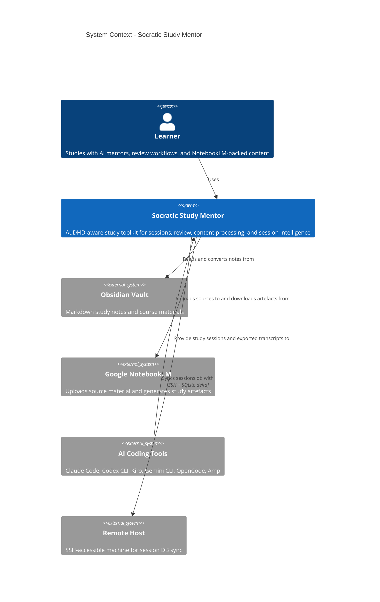
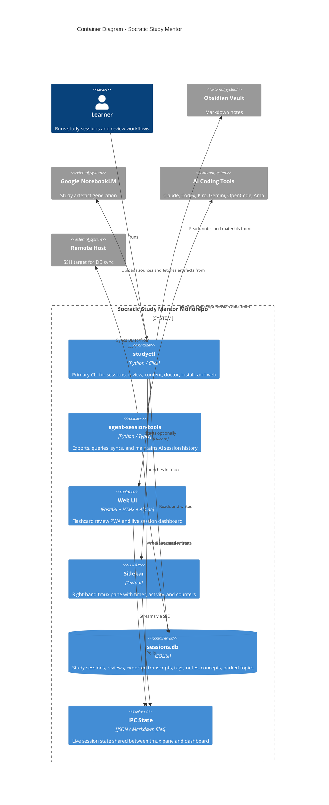
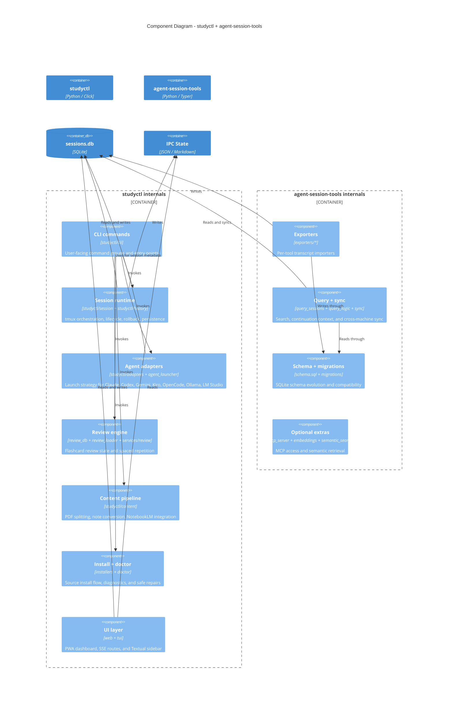

# Architecture

Current architecture and code map for the `studyctl` monorepo.

This page is the release-oriented source of truth for:
- system boundaries
- runtime containers
- major internal components
- repo structure / code map

For workflow-heavy operational detail, see [System Overview](system-overview.md).

## C4 Context



## C4 Container



## C4 Component



## Code Map

### Monorepo

```text
socratic-study-mentor/
├── packages/
│   ├── studyctl/
│   │   ├── src/studyctl/
│   │   │   ├── adapters/      # Agent launch adapters and local-LLM frontends
│   │   │   ├── cli/           # Click command surface
│   │   │   ├── content/       # NotebookLM and PDF processing pipeline
│   │   │   ├── doctor/        # Health checks and auto-fix diagnostics
│   │   │   ├── history/       # Study session persistence layer
│   │   │   ├── logic/         # Functional-core orchestration helpers
│   │   │   ├── mcp/           # studyctl MCP server/tooling
│   │   │   ├── services/      # Review/content service wrappers
│   │   │   ├── session/       # tmux orchestration and cleanup
│   │   │   ├── tui/           # Textual sidebar
│   │   │   ├── web/           # FastAPI routes and static assets
│   │   │   ├── installers.py  # Typed source-install helpers
│   │   │   ├── review_db.py   # Flashcard scheduling DB
│   │   │   └── settings.py    # Shared config loading
│   │   └── tests/
│   └── agent-session-tools/
│       ├── src/agent_session_tools/
│       │   ├── exporters/     # Claude, Codex, Gemini, Kiro, OpenCode, Aider, LiteLLM, RepoPrompt
│       │   ├── integrations/  # Git / editor integration helpers
│       │   ├── migrations.py  # sessions.db schema evolution
│       │   ├── query_logic.py # Search / continuation logic
│       │   ├── query_sessions.py
│       │   ├── sync.py
│       │   ├── mcp_server.py
│       │   └── export_sessions.py
│       └── tests/
├── agents/                    # Per-tool agent definitions and shared prompts
├── docs/                      # User, developer, architecture, and ops docs
├── scripts/                   # Thin source-install and helper scripts
├── Formula/studyctl.rb        # Homebrew formula
└── pyproject.toml             # Workspace root
```

### Important entry points

| Area | Entry point | Notes |
|---|---|---|
| Main CLI | `packages/studyctl/src/studyctl/cli/__init__.py` | Lazy command registration |
| Study sessions | `packages/studyctl/src/studyctl/cli/_study.py` | High-level session UX |
| Session runtime | `packages/studyctl/src/studyctl/session/start.py` | Startup, rollback, tmux orchestration |
| Install flow | `packages/studyctl/src/studyctl/cli/_install.py` | Typed tool/agent install commands |
| Doctor | `packages/studyctl/src/studyctl/cli/_doctor.py` | Diagnostics and `--fix` |
| Export | `packages/agent-session-tools/src/agent_session_tools/export_sessions.py` | Transcript import CLI |
| Query | `packages/agent-session-tools/src/agent_session_tools/query_sessions.py` | Search and write actions |
| Sync | `packages/agent-session-tools/src/agent_session_tools/sync.py` | Cross-machine DB sync |

## Design Notes

- `studyctl` is the user-facing orchestration package.
- `agent-session-tools` is the durable session-intelligence/data package.
- The cross-package dependency is one-way: `studyctl` uses `agent-session-tools`, not the reverse.
- Source installs are now driven by `studyctl install tools`, `studyctl install agents`, and `studyctl doctor --fix`; the shell scripts are compatibility wrappers.
- Session startup is designed to fail closed: if tmux/sidebar/agent startup breaks, the DB session and IPC state are rolled back.
