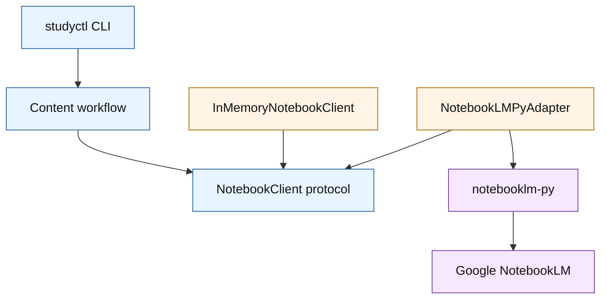
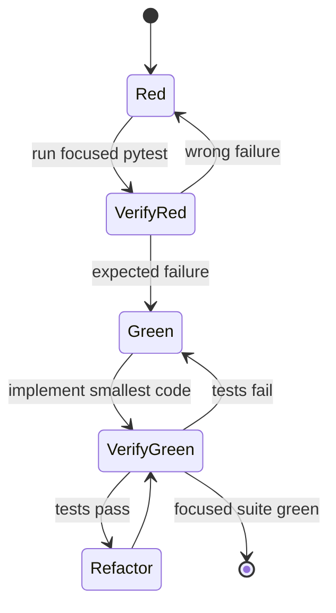
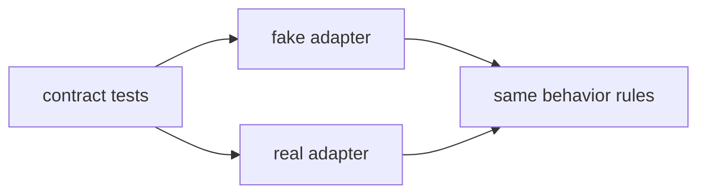

# Adapter Pattern For NotebookLM Workflows

This note explains the strict adapter approach used for the local NotebookLM
simulation boundary in `studyctl`.

## What

The adapter pattern puts a stable interface between application code and an
external dependency.

In this repo, the application logic should depend on a small `NotebookClient`
contract, not directly on `notebooklm-py`, browser auth, Google RPC responses,
or network timing.

## Why It Matters

NotebookLM is valuable but operationally awkward:

- It needs authentication.
- It depends on a third-party service.
- It can fail because of quota, browser state, cookies, rate limits, or RPC
  changes.
- It is expensive to test repeatedly.

Those are infrastructure concerns. They should sit at the edge of the system.
The study workflow itself should be testable using local files and local data.

The production rule is:

> Core workflow code talks to a port. Real services and fakes are adapters.

## Networking Analogy

Think of the adapter like a routing boundary.

Your internal network should not depend on the exact implementation details of
an upstream provider. You define your local routing policy, then peer with the
provider through a controlled edge.

In code:

- The protocol is the routing policy.
- The real adapter is the provider edge.
- The fake adapter is a lab router.
- Contract tests are your BGP/session validation checks.

## Shape In This Repo

```text
studyctl content workflow
        |
        v
NotebookClient protocol
        |
        +--> InMemoryNotebookClient fake
        |
        +--> NotebookLMPyAdapter real implementation
```

The workflow owns the behavior:

- create notebook if missing
- upload new source
- skip unchanged source
- replace changed source
- report stale remote source
- surface auth failures as expected errors

The adapter owns the mechanics:

- how to authenticate
- how to call NotebookLM
- how to map external source objects into internal dataclasses
- how to translate upstream exceptions

## Dependency Direction



The important detail: the workflow imports the protocol, not the real adapter.

That keeps this kind of dependency out of core workflow code:

```python
from notebooklm import NotebookLMClient  # avoid in workflow code
```

Instead, workflow code receives a client that satisfies the protocol:

```python
async def sync_notebook_sources(
    client: NotebookClient,
    *,
    notebook_title: str,
    uploads: list[SourceUpload],
) -> NotebookSyncResult:
    ...
```

## Minimal Port

The port should be boring and small. It expresses what `studyctl` needs, not
everything NotebookLM can do.

```python
from pathlib import Path
from typing import Protocol
from dataclasses import dataclass


@dataclass(frozen=True)
class NotebookRef:
    id: str
    title: str


@dataclass(frozen=True)
class SourceUpload:
    path: Path
    title: str
    content_hash: str


@dataclass(frozen=True)
class NotebookSource:
    id: str
    title: str
    path: Path
    content_hash: str
    status: str = "ready"


class NotebookClient(Protocol):
    async def ensure_notebook(self, title: str) -> NotebookRef: ...

    async def list_sources(self, notebook_id: str) -> list[NotebookSource]: ...

    async def add_source(self, notebook_id: str, upload: SourceUpload) -> NotebookSource: ...

    async def replace_source(
        self,
        notebook_id: str,
        source_id: str,
        upload: SourceUpload,
    ) -> NotebookSource: ...
```

**Teaching moment**: a `Protocol` is structural typing - if an object has the
right methods, it satisfies the interface. This is Python's duck typing with
type-checker support.

## Workflow Code

The workflow has no idea whether the client is fake or real.

```python
async def sync_notebook_sources(
    client: NotebookClient,
    *,
    notebook_title: str,
    uploads: list[SourceUpload],
) -> NotebookSyncResult:
    notebook = await client.ensure_notebook(notebook_title)
    existing = await client.list_sources(notebook.id)
    existing_by_path = {source.path: source for source in existing}
    desired_paths = {upload.path for upload in uploads}

    created: list[str] = []
    updated: list[str] = []
    skipped: list[str] = []

    for upload in uploads:
        current = existing_by_path.get(upload.path)
        if current is None:
            source = await client.add_source(notebook.id, upload)
            created.append(source.title)
            continue

        if current.content_hash == upload.content_hash:
            skipped.append(current.title)
            continue

        source = await client.replace_source(notebook.id, current.id, upload)
        updated.append(source.title)

    stale = [source.title for source in existing if source.path not in desired_paths]
    return NotebookSyncResult(
        notebook=notebook,
        created=created,
        updated=updated,
        skipped=skipped,
        stale=stale,
    )
```

This is the core value of the pattern: the interesting behavior is simple,
local, and directly testable.

## Fake Adapter

The fake adapter is not a mock. It is a small implementation of the same port.

```python
class InMemoryNotebookClient:
    def __init__(self, *, authenticated: bool = True) -> None:
        self._authenticated = authenticated
        self._notebooks: dict[str, _NotebookState] = {}
        self._next_notebook_id = 1
        self._next_source_id = 1

    async def ensure_notebook(self, title: str) -> NotebookRef:
        self._require_auth()
        for state in self._notebooks.values():
            if state.notebook.title == title:
                return state.notebook

        notebook = NotebookRef(id=f"nb-{self._next_notebook_id}", title=title)
        self._next_notebook_id += 1
        self._notebooks[notebook.id] = _NotebookState(notebook=notebook)
        return notebook
```

Use this fake for:

- unit tests
- local simulation
- planner development
- CI
- demos that should not touch real NotebookLM

Do not use it to prove Google integration works. That belongs in a smaller
number of integration tests around the real adapter.

## Real Adapter

The real adapter should map `notebooklm-py` into the internal protocol.

Sketch:

```python
class NotebookLMPyAdapter:
    def __init__(self, client: NotebookLMClient) -> None:
        self._client = client

    async def ensure_notebook(self, title: str) -> NotebookRef:
        try:
            notebooks = await self._client.notebooks.list()
            for notebook in notebooks:
                if notebook.title == title:
                    return NotebookRef(id=notebook.id, title=notebook.title)

            created = await self._client.notebooks.create(title=title)
            return NotebookRef(id=created.id, title=created.title)
        except NotebookLMError as exc:
            raise NotebookClientError(str(exc)) from exc
```

The adapter can use current `notebooklm-py` features:

- `client.notebooks.get_metadata()` for source metadata inspection
- `client.sources.list()` for source inventory
- `client.sources.add_file()` for upload
- source status helpers for readiness
- `download_quiz()` and `download_flashcards()` for review import
- the upstream exception hierarchy for clean user-facing errors

The workflow should not depend on those concrete types directly.

## TDD Method Used

The implementation follows this loop:



For the NotebookLM boundary, the first tests define behavior:

```python
async def test_sync_skips_unchanged_sources() -> None:
    client = InMemoryNotebookClient()
    await sync_notebook_sources(
        client,
        notebook_title="Python",
        uploads=[SourceUpload(path=Path("a.md"), title="a", content_hash="same")],
    )

    result = await sync_notebook_sources(
        client,
        notebook_title="Python",
        uploads=[SourceUpload(path=Path("a.md"), title="a", content_hash="same")],
    )

    assert result.created == []
    assert result.updated == []
    assert result.skipped == ["a"]
```

That test fails before the module exists. Then the minimum protocol and fake are
created to pass it.

## Contract Tests

Contract tests validate behavior shared by all adapters.



The contract should cover:

- creates notebook
- uploads new sources
- skips unchanged sources
- updates changed sources
- reports stale sources
- raises a stable auth error

Later, the same contract can run against the real adapter with explicit
credentials and an integration-test marker.

## Common Mistakes

- Putting `notebooklm-py` imports in core workflow code.
- Mocking every method call instead of using a small fake with real behavior.
- Making the port mirror the full external library API.
- Testing only the happy path and missing stale/update/auth cases.
- Letting adapter exceptions leak directly into CLI tracebacks.
- Using the fake as proof that the external service still works.

## Practical Rule

If a behavior can be expressed as local data in and local data out, test it with
the fake.

Only use real NotebookLM tests for the thin edge where `studyctl` maps its
internal protocol to the external library.
