# Codebase Review — socratic-study-mentor

**Date**: 2026-04-08
**Reviewer**: Claude Opus 4.6 (automated comprehensive review)
**Commit**: `a120ae6` (main)
**Version**: v2.2.0

---

## Executive Summary

This is a well-structured Python monorepo implementing an AuDHD-aware study pipeline with CLI, web UI, TUI, and MCP interfaces. The codebase demonstrates strong engineering fundamentals — clean linting, parameterised SQL, timing-safe auth, a genuine service layer, and an impressive test suite. However, the deep analysis uncovered one **real bug** (BM25 search returns worst-match-first), several **architectural layer violations**, **dead code**, and a handful of **data integrity risks** that warrant attention.

| Metric | Value | Assessment |
|--------|-------|------------|
| Source LOC | 25,095 | Moderate — well-scoped |
| Test LOC | 22,408 | Excellent test investment |
| Test:Source ratio | 0.89:1 | Strong |
| Tests collected | 1,499 | Comprehensive |
| Ruff violations | 0 | Clean |
| Pyright errors (src) | 4 | All optional import resolution |
| Pyright errors (tests) | 44 | Mostly fixture typing |
| Complex functions (C901) | 27 | Needs attention |
| Public funcs missing docstrings | 51 / 703 | 93% coverage — good |
| Return type annotations | 536 / 703 | 76% coverage — acceptable |
| TODO/FIXME in production | 0 | Clean |

---

## 1. Architecture Overview

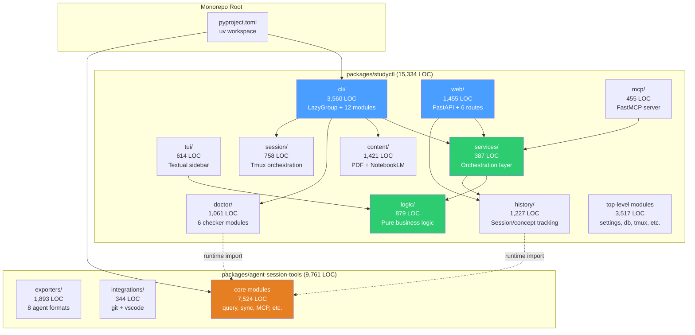

### Assessment: Strong layered architecture

The codebase follows a clean layered design:

1. **Presentation layer** — CLI (Click), Web (FastAPI), TUI (Textual), MCP (FastMCP)
2. **Service layer** — `services/` orchestrates business operations
3. **Logic layer** — `logic/` contains pure functions (no I/O)
4. **Data layer** — `db.py`, `review_db.py`, `history/` handle persistence

The service layer is thin (387 LOC) which is appropriate — it primarily composes logic and data access for the presentation layers to consume.

### Layer Violations (Found by Deep Analysis)

Three places in the codebase violate the intended layer direction by importing **upward** from lower layers into `cli/`:

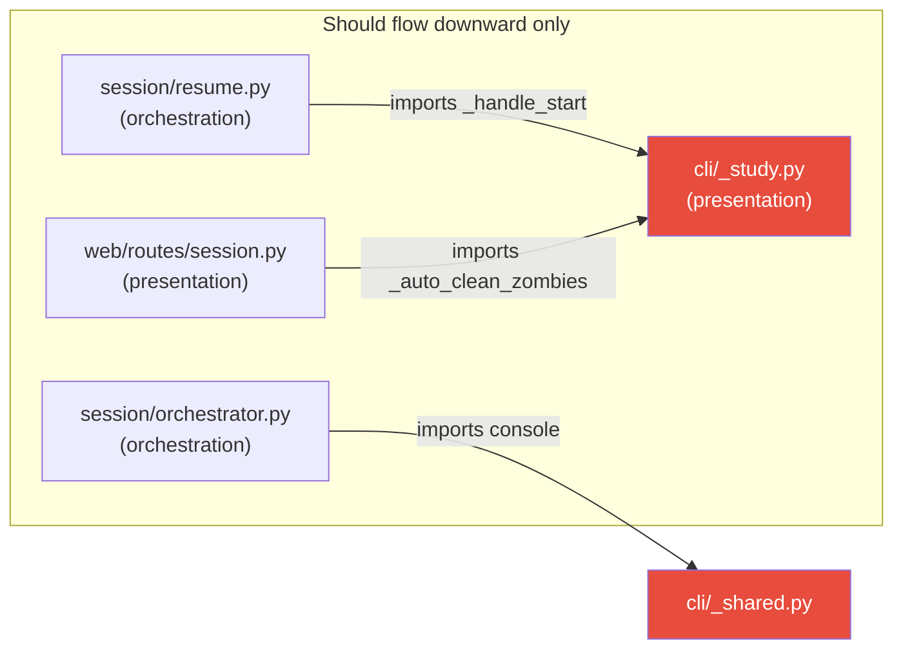

| Violation | Location | Import |
|-----------|----------|--------|
| `session/resume.py:93` | → `cli._study._handle_start` | Session layer calls up into CLI private function |
| `web/routes/session.py:415` | → `cli._study._auto_clean_zombies` | Web route calls CLI private function |
| `session/orchestrator.py:236` | → `cli._shared.console` | Partially fixed (`output.py` exists but old import remains) |

**Fix**: Extract `_handle_start` and `_auto_clean_zombies` into `session/` or `logic/` — both CLI and web should call down, not sideways.

---

## 2. Package Analysis

### 2.1 studyctl — CLI Application

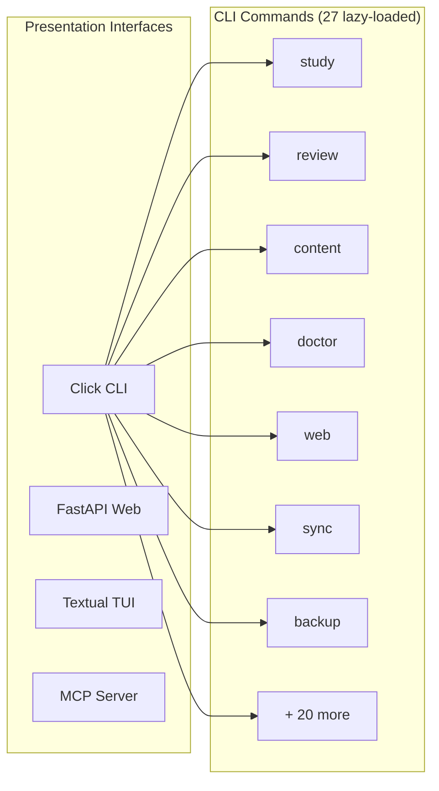

**Strengths:**
- `LazyGroup` pattern (`cli/_lazy.py`) defers all imports until a command is actually invoked — excellent for CLI startup time
- 27 commands organised across 12 modules with logical grouping
- `@click.version_option()` on the root group
- Service layer prevents CLI/web code duplication

**Concerns:**
- `_handle_start()` in `_study.py:394` has complexity 21 — this is the most business-critical path
- `register_tools()` in `mcp/tools.py:35` has complexity 34 — a monolithic tool registration function
- `load_settings()` in `settings.py:161` has complexity 19 — manual YAML→dataclass parsing

### 2.2 agent-session-tools — Cross-Agent Session Database

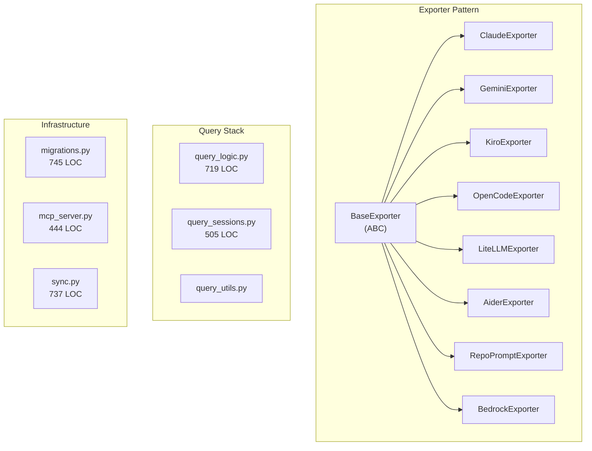

**Strengths:**
- Clean `BaseExporter` ABC pattern with 8 consistent implementations
- Robust migration system with version tracking via `PRAGMA user_version`
- MCP server exposes 15+ tools for AI agent consumption
- Separate `sync.py` for SSH-based cross-machine replication

**Concerns:**
- Query layer split across 3 files (query_logic/query_sessions/query_utils) with unclear boundaries — `query_logic.py` alone is 719 LOC
- `_create_server()` has complexity 28 — all MCP tool registrations in one function
- `export_context()` has complexity 23 — deeply branching context generation

### 2.3 Data Integrity Issues

#### ~~BM25 Search Returns Worst-Match-First~~ — FALSE POSITIVE (Retracted)

~~Originally reported as a bug.~~ **Verified as correct behaviour.** SQLite FTS5 `bm25()` returns negative values where more-negative = better match. Default `ORDER BY` ASC sorts -10, -5, -1 — correctly putting best matches first. All 3 locations are fine.

#### Archive Schema Missing Columns (Data Loss on Archive)

`maintenance._archive()` (lines 278-329) creates the archive database with a hardcoded schema that is **missing columns** added in later migrations: `session_type`, `content_hash`, `import_fingerprint`, `seq`. Sessions moved to archive **silently lose data** in these columns.

#### Mixed UTC/Local Timestamps

Most of the codebase uses `datetime.now(UTC)`, but three locations use naive `datetime.now()`:
- `parking.py:235` — parked topic timestamps
- `history/medication.py:20` — medication timing
- `cli/_session.py:267` — display only (acceptable)

This means the same database has a mix of UTC and local-time timestamps.

#### VSCode Integration is Dead Code

`query_sessions.py` lines 474-476 contain stub functions that always `raise typer.Exit(1)`:
```python
def snippet(...):
    print("❌ VSCode integration is temporarily disabled due to circular import")
    raise typer.Exit(1)
```
The circular import was never resolved. The `integrations/vscode.py` module has been refactored to accept `resolve_fn=None` but the import in `query_sessions.py` was never re-enabled.

#### Legacy `web/server.py` is Dead Code (259 LOC)

The stdlib-based `StudyHandler` is entirely superseded by `web/app.py` (FastAPI). `cli/_web.py` uses FastAPI exclusively. No caller references `web/server.py` anywhere in the codebase.

### 2.4 Exporter Consistency Issues

The 8 exporters show some protocol divergence:

| Issue | Exporters |
|-------|-----------|
| Missing `batch_size` parameter | Aider, LiteLLM |
| Doesn't use shared `commit_batch()` | LiteLLM (own `executemany`), Bedrock (duplicates logic) |
| Never re-imports updated sessions | Gemini, OpenCode (existence-only check) |
| `raise e` instead of bare `raise` (loses traceback) | Bedrock (`base.py:110`) |
| Silent `except Exception: pass` with no logging | LiteLLM (2 locations), Claude, Aider, Gemini, RepoPrompt |

### 2.5 Module-Level Side Effects

Three modules call `logging.basicConfig()` at import time, which configures the **root logger** for the entire process:

- `query_logic.py:39-51`
- `maintenance.py:38-50`
- `sync.py:55-67`

This means importing any of these modules changes logging configuration globally — affecting tests and any consuming code.

---

## 3. Code Quality Deep Dive

### 3.1 Linting: Clean

```
$ uv run ruff check packages/
All checks passed!
```

Zero violations. The `ruff` configuration (`select = ["E", "F", "W", "I", "N", "UP", "B", "A", "C4", "SIM", "TCH", "RUF"]`) covers a good spread of rules. The only notable omission is **C901** (complexity) being excluded from the default ruleset — enabling it would flag 27 functions.

### 3.2 Cyclomatic Complexity Hotspots

27 functions exceed complexity 10. The worst offenders:

| Function | File | Complexity | Notes |
|----------|------|-----------|-------|
| `register_tools` | `mcp/tools.py:35` | **34** | Monolithic tool registration |
| `_create_server` | `mcp_server.py:52` | **28** | All MCP tools in one function |
| `export_context` | `query_logic.py:382` | **23** | Deeply branching |
| `_handle_start` | `cli/_study.py:394` | **21** | Critical study session startup |
| `load_settings` | `settings.py:161` | **19** | Manual YAML parsing |
| `end_session_common` | `session/cleanup.py:40` | **19** | Session teardown logic |
| `_generate_resume_context` | `query_logic.py:575` | **17** | Resume context building |
| `format_study_briefing` | `logic/briefing_logic.py:59` | **16** | String formatting branches |
| `start_session` | `web/routes/session.py:344` | **16** | Web session startup |
| `proxy_terminal_ws` | `web/routes/terminal_proxy.py:103` | **16** | WebSocket proxy |

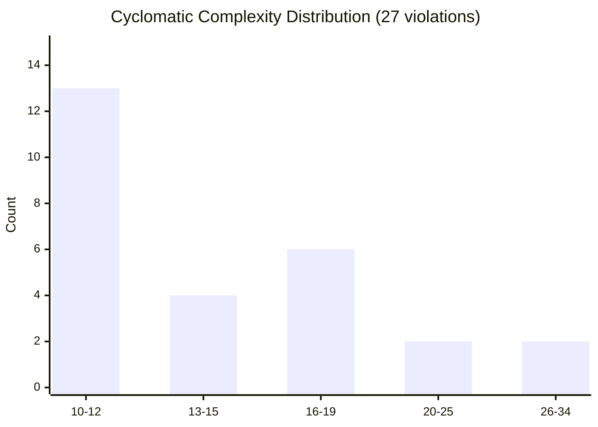

**Recommendation**: The top 5 functions should be refactored. The MCP registration functions (complexity 28-34) can be trivially split by registering tool groups in separate functions. `load_settings()` would benefit from a data-driven approach (e.g., a field mapping dict instead of per-field if-blocks).

### 3.3 Type Safety

```
Production code (pyright): 4 errors — all optional import resolution
  - notebooklm_client.py:14 — "notebooklm" not resolved (optional dep)
  - splitter.py:13 — "pymupdf" not resolved (optional dep)
  - mcp/tools.py:188 — "pymupdf" not resolved (optional dep)

Test code (pyright): 44 additional errors
  - test_topic_resolver.py — 5× reportOptionalMemberAccess
  - test_web_artefacts.py — 2× reportInvalidTypeForm (fixture typing)
  - test_web_session.py — 2× reportArgumentType (str vs Path)
  - test_web_terminal.py — 4× reportAttributeAccessIssue (Playwright types)
```

The production code is effectively clean — the 4 errors are all from optional dependencies imported behind `try/except` blocks, which is the correct pattern. The test errors are minor typing issues that should be fixed but aren't blocking.

### 3.4 Exception Handling

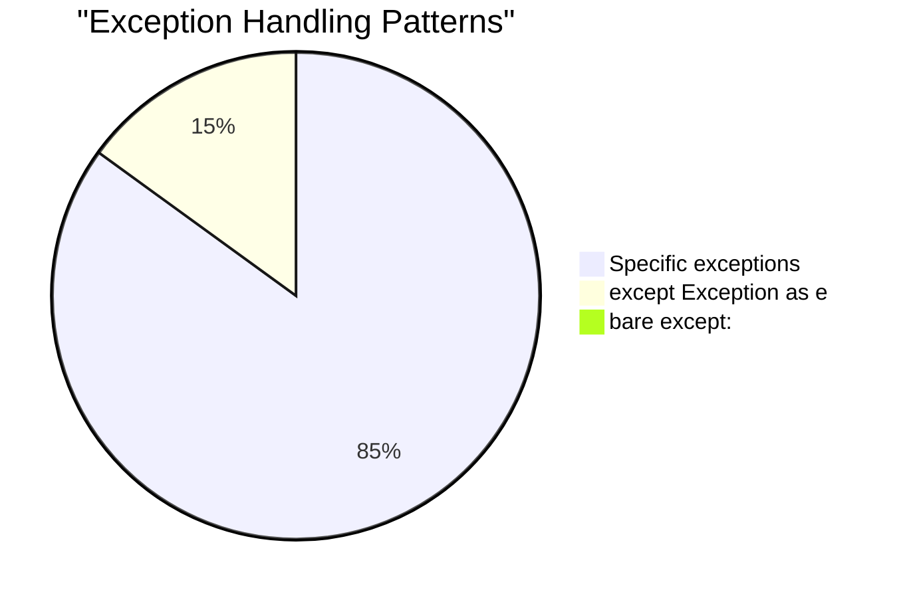

**Zero bare `except:` clauses** — good discipline.

However, there are **15+ `except Exception` catches** spread across:
- `agent_session_tools/maintenance.py` — 5 instances
- `agent_session_tools/query_sessions.py` — 3 instances
- `agent_session_tools/query_logic.py` — 2 instances
- Various exporters — 3 instances (silently swallowing parse errors)

Most of these are in data-processing code where silently continuing past a corrupt record is reasonable, but the broad catches in `maintenance.py` could mask genuine bugs during database operations.

### 3.5 Docstring & Documentation Coverage

| Category | Count | With Docstring | Coverage |
|----------|-------|----------------|----------|
| Public functions | 703 | 652 | **93%** |
| Return type annotations | 703 | 536 | **76%** |

The 51 missing docstrings are mostly in:
- Doctor checker functions (`doctor/core.py`, `doctor/__init__.py`) — 12 functions
- Content model serialization (`content/syllabus.py`) — 5 functions
- CLI lazy-loading internals (`cli/_lazy.py`) — 2 functions

### 3.6 Duplicate Patterns

Three separate `_connect()` functions exist:

| Location | Signature | Delegates to db.py? |
|----------|-----------|---------------------|
| `review_db.py:30` | `_connect(db_path: Path)` | Yes |
| `parking.py:19` | `_connect()` | Yes (via `connect_db`) |
| `history/_connection.py:23` | `_connect()` | Yes |

All three delegate to the shared `connect_db()` factory in `db.py`, which is the correct pattern. The wrappers exist because each module adds its own table-creation/migration logic. This is acceptable — the duplication is in the 1-line wrapper, not the connection logic.

---

## 4. Test Suite Analysis

### 4.1 Overview

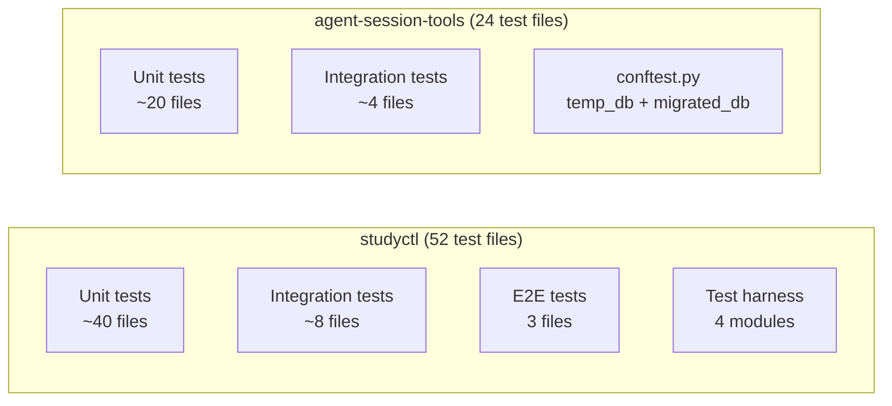

| Package | Test Files | Tests | Source LOC | Test LOC |
|---------|-----------|-------|-----------|----------|
| studyctl | 52 | ~800 | 15,334 | ~13,500 |
| agent-session-tools | 24 | ~679 | 9,761 | ~8,900 |
| **Total** | **76** | **1,499** | **25,095** | **22,408** |

### 4.2 Coverage Gaps — agent-session-tools

These source modules have **no dedicated test file**:

| Module | LOC | Risk | Notes |
|--------|-----|------|-------|
| `embeddings.py` | 593 | **High** | ML embedding logic |
| `semantic_search.py` | 569 | **High** | Search implementation |
| `sync.py` | 737 | **Medium** | Tested via test_sync.py ✓ |
| `export_sessions.py` | ~100 | Medium | May be tested via export_cli |
| `file_hotspots.py` | ~80 | Low | Utility module |
| `mcp_speak.py` | ~50 | Low | TTS bridge |
| `profiles.py` | ~80 | Low | Profile config |
| `tokens.py` | ~60 | Low | Token counting |
| `tutor_checkpoint.py` | ~80 | Low | Checkpoint utility |
| `integrations/git.py` | ~180 | Medium | Git context extraction |
| `integrations/vscode.py` | ~160 | Medium | VS Code export |

**`embeddings.py` and `semantic_search.py`** are the highest-risk gaps — they contain 1,162 LOC of ML/search logic with no direct test coverage.

### 4.3 Coverage Gaps — studyctl

Many studyctl modules are tested indirectly via CLI and integration tests rather than having dedicated unit test files. This is acceptable for thin modules but concerning for:

| Module | LOC | Tested Via |
|--------|-----|-----------|
| `web/routes/session.py` | 569 | test_web_session.py ✓ |
| `web/routes/terminal_proxy.py` | ~200 | test_web_terminal.py ✓ |
| `content/markdown_converter.py` | ~150 | No direct tests |
| `content/storage.py` | ~200 | test_content_storage.py ✓ |
| `maintenance.py` | ~100 | No direct tests |

### 4.4 Test Configuration Issue

The `e2e` pytest marker is used in 3 test files but **not registered** in `pyproject.toml`:

```
packages/studyctl/tests/test_harness_matrix.py:53    pytest.mark.e2e
packages/studyctl/tests/test_web_terminal.py:30      pytest.mark.e2e
packages/studyctl/tests/test_e2e_session_demo.py:48  pytest.mark.e2e
```

Only `integration` is registered:
```toml
markers = [
    "integration: requires external infrastructure (tmux, real DB, network)",
]
```

This produces `PytestUnknownMarkWarning` during test collection.

### 4.5 Test Quality Concerns (Deep Analysis)

**Weak assertions that always pass:**
- `test_mcp_server.py` `TestSessionContext` — `test_context_compressed_default`, `test_context_summary_format`, and `test_context_only_format` assert only `isinstance(result, str)` and `len(result) > 0`. Any non-empty string (including an error message) passes.
- `test_study.py:32` — `assert result.exit_code != 0 or "Topic is required" in result.output`. If the command fails for any unrelated reason, the test passes.

**Integration test race condition:**
`StudySession` and `TerminalSession` in the test harness use hardcoded `~/.config/studyctl/` paths. Two parallel test processes on the same machine will race on IPC files. The `STUDYCTL_SESSION_DIR` env var exists for `session_state.py` isolation but is not used by the harness.

**Fixed sleeps in harness (contradicts stated policy):**
- `TmuxHarness.kill_session` — `time.sleep(0.3)` unconditional sleep
- `TerminalSession.attach_and_send_q` — `time.sleep(2)` waiting for render
- Mock agent scripts — `sleep 2  # wait for sidebar` in 3 places

**Implementation coupling:**
- `test_mcp_server.py` accesses `tool.fn` (FastMCP internal attribute) — will break if FastMCP renames the attribute
- `test_query_logic.py` tests private functions `_generate_resume_context`, `_generate_branch_context`, `_generate_summary_context`

**Temp file leak:**
`test_sync.py` `test_delta_round_trip` creates a `NamedTemporaryFile` with manual `unlink()` at end — if an assertion fails before the unlink, the temp file is leaked. Should use a fixture or `try/finally`.

---

## 5. Security Assessment

### 5.1 Scorecard

| Category | Rating | Details |
|----------|--------|---------|
| SQL Injection | **Pass** | All queries use `?` parameter binding |
| Path Traversal | **Partial** | MCP tools validate via `_safe_course_dir()`, but `list_artefacts` route has a gap |
| Authentication | **Pass** | Timing-safe Basic Auth with `hmac.compare_digest()` |
| Secret Detection | **Pass** | Pre-commit hooks: detect-secrets, detect-private-key, detect-aws-credentials |
| Dependency Pins | **Acceptable** | `>=` floor pins (standard for libraries, not apps) |
| Command Injection | **Pass** | Zero `shell=True` in entire codebase; `shlex.quote()` for SSH args |
| CI Action Pinning | **Low risk** | Third-party actions use mutable tags, not commit SHAs |

### 5.2 Authentication Detail

`web/auth.py` implements HTTP Basic Auth correctly:
- Timing-safe comparison via `hmac.compare_digest` for both username and password
- Returns 401 with `WWW-Authenticate` header on failure
- No-op pass-through when password is empty (local-only mode)
- Graceful handling of malformed Base64

**Note**: Basic Auth transmits credentials in Base64 (not encrypted). This is acceptable for LAN-only access (`--lan` flag) but would need TLS for any internet-facing deployment.

### 5.3 SQL Safety

All SQL throughout the codebase uses parameterised queries:

```python
# review_db.py — correct pattern (representative)
conn.execute(
    "SELECT ease_factor, interval_days FROM card_reviews "
    "WHERE card_hash = ? ORDER BY reviewed_at DESC LIMIT 1",
    (card_hash,),
)
```

No instances of f-string or `.format()` SQL construction were found in production code.

**Note**: Some f-string SQL exists for table names (e.g., `maintenance.py:144` `PRAGMA table_info({table_name})`) but the values come from `sqlite_master` queries or hardcoded constants, not user input. The pattern is fragile but not currently exploitable.

### 5.3a Path Traversal Gap — `list_artefacts` Route

`web/routes/artefacts.py:40` constructs `base / course` and calls `iterdir()` **without** the `is_relative_to()` check that `_validate_artefact_path` correctly applies. A `../` in the `course` parameter could read directory listings outside the content base. The `_validate_artefact_path` function shows the correct pattern already exists — it just needs to be applied to `list_artefacts` too.

### 5.4 Pre-commit Pipeline

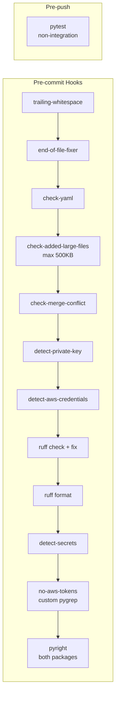

**Gap**: No `bandit` (Python security scanner) in pre-commit or CI. Consider adding for automated vulnerability detection.

### 5.5 CI Pipeline

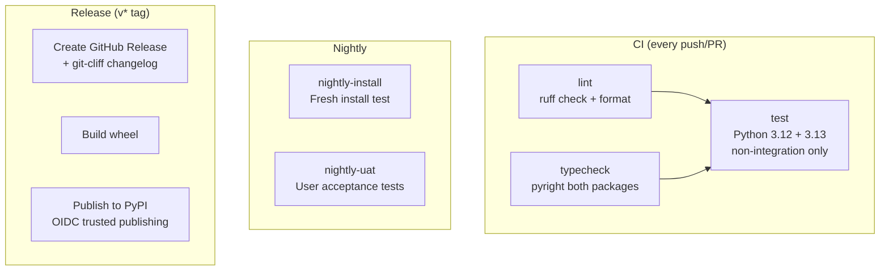

**Strengths:**
- Multi-Python matrix testing (3.12, 3.13)
- OIDC trusted publishing (no stored API tokens)
- Nightly install verification
- Git-cliff automated changelog generation

**Gaps:**
- No `bandit` or `safety` security scanning in CI
- No test coverage reporting (no `--cov` flag in CI pytest)
- No dependency vulnerability scanning (e.g., `pip-audit` or `uv audit`)
- `publish.yml` has `permissions: contents: write` at workflow level — `build` job doesn't need this
- Third-party action tags (`orhun/git-cliff-action@v4`, `pypa/gh-action-pypi-publish@release/v1`) not pinned to commit SHAs
- Pre-release gate (`pre-release.yml`) runs parallel to publish — not enforced unless branch protection is configured
- `docs.yml` will fail if `docs/artefacts.md` is missing (see Packaging section)

---

## 6. Build & Packaging

### 6.1 Workspace Structure

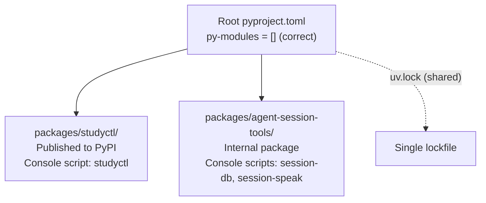

The workspace is correctly configured with `py-modules = []` at the root (non-installable workspace container) and two properly-defined members.

### 6.2 Packaging & Documentation Issues

| Issue | Severity | Detail |
|-------|----------|--------|
| **`docs/artefacts.md` missing** | **Breaks build** | Listed in `mkdocs.yml` nav but file doesn't exist — `mkdocs build` will fail |
| **`install.sh` Python check is >= 3.10** | High | Packages require >= 3.12; misleading "prerequisites met" on 3.10/3.11 |
| **`agents/manifest.json` stale** | Medium | Contains entries for files moved to `_archived/`; regeneration needed |
| **`install-agents.sh` broken refs** | Medium | `CLAUDE_LINKS` includes `mentor-reviewer.yaml` (archived); `AMP_LINKS` includes `agents/amp/` (doesn't exist) |
| **`agent-session-tools` not published** | Medium | README advertises `pip install agent-session-tools` but no publish workflow exists |
| **`docs/contributing.md` is a duplicate** | Low | Verbatim copy of root `CONTRIBUTING.md`; will drift. Use mkdocs `!include` or symlink |
| **Root `pyproject.toml` version 1.0.0** | Info | Packages are at 2.x; root version is meaningless but confusing |
| **`sync.py` has own CONFIG_PATH** | Medium | Hardcoded `~/.config/studyctl/config.yaml` ignoring `STUDYCTL_CONFIG` env var |

### 6.3 Git Hygiene Issues

| Issue | Severity | Path |
|-------|----------|------|
| **Git repo corruption** | **High** | HEAD and main refs point to invalid SHA |
| Tracked `.coverage` file | Medium | `.coverage` (76 KB) |
| Tracked `egg-info/` | Medium | `socratic_study_mentor.egg-info/` |
| Tracked stale lock file | Low | `uv-3372627849829312.lock` (0 bytes) |
| Tracked `uv.lock` | Info | Intentional (workspace lockfile) |

```
$ git fsck
error: refs/heads/main: invalid sha1 pointer a120ae6...
error: refs/remotes/origin/main: invalid sha1 pointer a120ae6...
error: HEAD: invalid sha1 pointer a120ae6...
```

The git corruption is the most concerning finding. The working tree is intact and all files are present, but the object database has integrity issues. This may be related to worktree operations (`.claude/worktrees/` exists) or a partial garbage collection.

**Recommendation**: Run `git gc --prune=now` and if that doesn't resolve it, re-clone from origin.

### 6.3 Gitignore Coverage

`.gitignore` contains patterns for `.coverage`, `*.egg-info/`, and `uv-*.lock`, but these files were added to tracking **before** the patterns were created. `.gitignore` does not retroactively untrack files.

**Fix**: `git rm --cached .coverage socratic_study_mentor.egg-info/ uv-3372627849829312.lock`

---

## 7. Dependency Analysis

### 7.1 studyctl Dependencies

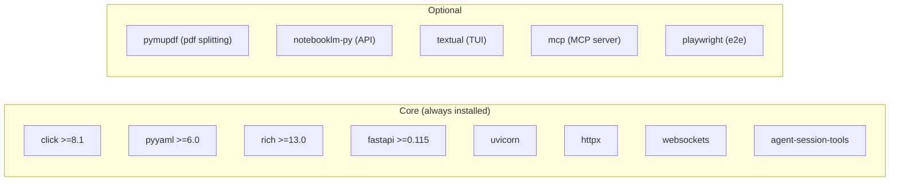

**Pin style**: All use `>=` floor pins. This is standard for library packages but for an application like studyctl, pinning to minor versions (`~=`) would provide more reproducibility. The shared `uv.lock` compensates for this in practice.

### 7.2 Dev Dependencies

Properly placed in `[dependency-groups]` (PEP 735) rather than `[project.optional-dependencies]`:
- pytest, pytest-cov, pytest-asyncio
- ruff, pyright, pre-commit
- httpx (test client), pexpect, textual[dev]

---

## 8. Recommendations

### Priority 1 — Fix Now (Bugs & Breakage)

| # | Issue | Impact | Effort | Status |
|---|-------|--------|--------|--------|
| ~~1~~ | ~~BM25 search ORDER BY bug~~ | ~~Search is broken~~ | | **FALSE POSITIVE** — retracted |
| 2 | **`list_artefacts` path traversal gap** — missing `is_relative_to()` check | Security | 5 min | **FIXED** |
| 3 | **`docs/artefacts.md` missing** — breaks `mkdocs build` and `docs.yml` CI | CI breakage | 5 min | **FIXED** |
| 4 | **`install.sh` Python check** — says >= 3.10, packages require >= 3.12 | Install failure | 2 min | **FIXED** |
| 5 | **Register `e2e` marker** — Add to `pyproject.toml` markers | Warning suppression | 1 min | **FIXED** |
| 6 | ~~Untrack artifacts~~ — Files were never tracked (corrupt HEAD caused false diagnosis) | ~~Repo hygiene~~ | | **NOT AN ISSUE** |

### Priority 2 — Fix Soon (Architecture & Data Integrity)

| # | Issue | Impact | Effort | Status |
|---|-------|--------|--------|--------|
| 7 | **Layer violations** — Extract `_handle_start`/`_auto_clean_zombies` from `cli/` to `session/` | Architecture | Medium | **FIXED** |
| 8 | **Archive schema drift** — Add missing columns to archive creation in `maintenance._archive()` | Data loss risk | Medium | **FIXED** |
| 9 | **Remove dead code** — `web/server.py` (259 LOC), VSCode integration stubs | Maintenance | Low | **FIXED** |
| 10 | **Module-level `logging.basicConfig()`** — Move to CLI entry points only | Test isolation | Medium | **FIXED** |
| 11 | **Mixed UTC/local timestamps** — Standardise `parking.py` and `medication.py` to UTC | Data consistency | Low | **FIXED** |
| 12 | **Refactor top-5 complex functions** | Maintainability | Medium | Open |
| 13 | **Add tests for embeddings.py + semantic_search.py** | Coverage gap (1,162 LOC) | Medium | Open |

### Priority 3 — Improve (Quality & DevOps)

| # | Issue | Impact | Effort | Status |
|---|-------|--------|--------|--------|
| 14 | **Exporter protocol consistency** — Add `batch_size` to Aider/LiteLLM, use shared `commit_batch` | API contract | Medium | **FIXED** |
| 15 | **Gemini/OpenCode re-import** — Add `updated_at` comparison for incremental updates | Correctness | Medium | **FIXED** |
| 16 | Add `bandit` + `pip-audit` to pre-commit and CI | Security scanning | Low | Open |
| 17 | Add `--cov` to CI pytest | Coverage visibility | Low | **FIXED** |
| 18 | Pin CI actions to commit SHAs | Supply chain | Low | Open |
| 19 | Fix 44 pyright test errors | Type safety | Medium | Open |
| 20 | `sync.py` CONFIG_PATH — use settings module instead of hardcoded path | Config consistency | Low | **FIXED** |
| 21 | Regenerate `agents/manifest.json` | Stale metadata | 5 min | **FIXED** |
| 22 | Fix `install-agents.sh` broken references | Install scripts | Low | **FIXED** |
| 23 | Split `query_logic.py` (719 LOC) into focused modules | Readability | Medium | Open |

### Architecture Recommendations

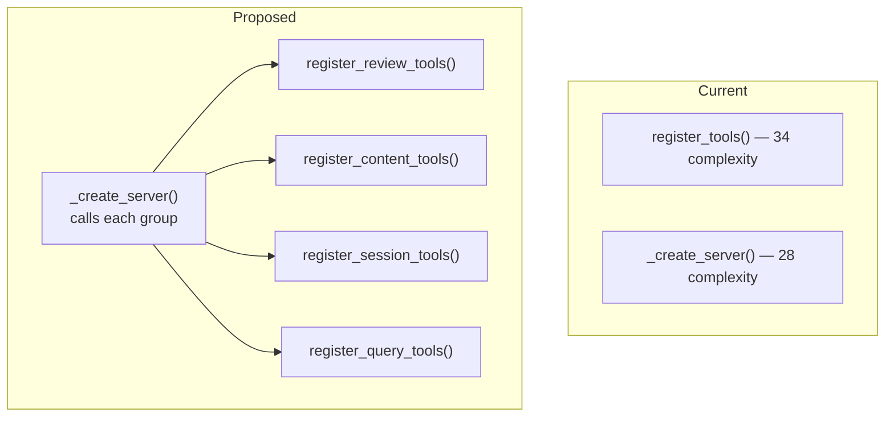

Similarly, `load_settings()` could be refactored from 27 if-blocks to a declarative field mapping:

```python
# Instead of 27 individual if-blocks:
FIELD_MAP = {
    "obsidian_base": (Path, Path.expanduser),
    "session_db": (Path, Path.expanduser),
    "state_dir": (Path, Path.expanduser),
    "sync_remote": (str, None),
    ...
}
```

---

## 9. What's Done Well

These deserve recognition as they represent deliberate engineering quality:

1. **LazyGroup CLI** — Fast startup with 27 deferred imports. Professional CLI experience.
2. **Shared `db.py` connection factory** — WAL mode + busy timeout applied consistently.
3. **Timing-safe auth** — `hmac.compare_digest` on both username and password fields.
4. **Path traversal protection** — `_safe_course_dir()` in MCP tools validates LLM-supplied paths.
5. **Zero ruff violations** — Clean linting across 25K LOC.
6. **Pre-commit pipeline** — 12 hooks including pyright, detect-secrets, and AWS credential scanning.
7. **OIDC publishing** — No stored PyPI tokens, uses trusted publishing.
8. **Service layer** — Proper separation allows CLI, Web, and MCP to share business logic.
9. **Test investment** — 1,499 tests with 0.89:1 test-to-source ratio.
10. **Multi-Python CI** — Tests run on both 3.12 and 3.13.

---

## 10. Cross-Package Dependency Map

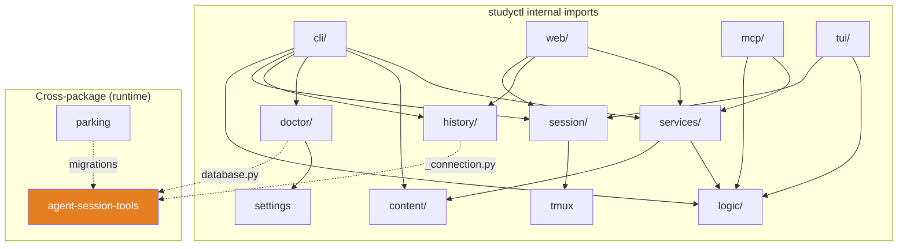

The cross-package dependency is unidirectional (studyctl → agent-session-tools), which is correct. All cross-package imports are runtime-deferred with `try/except` guards, allowing studyctl to function even if agent-session-tools is unavailable.

---

## Appendix: File Size Distribution

| LOC Range | Files | Notes |
|-----------|-------|-------|
| 1-50 | 42 | Mostly `__init__.py`, small utilities |
| 51-100 | 28 | Helper modules, models |
| 101-200 | 35 | Core business modules |
| 201-400 | 22 | CLI commands, exporters |
| 401-600 | 12 | Complex modules — review needed |
| 601-745 | 6 | `query_logic`, `sync`, `migrations`, `_study`, `sidebar`, `agent_launcher` |

The 6 files over 600 LOC are candidates for extraction if they continue growing.
