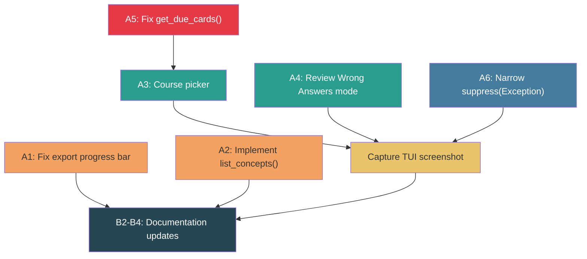

# TUI Polish, Documentation & Phase 1 Cleanup

## Enhancement Summary

**Re-deepened on:** 2026-03-15
**Agents used (8):** Learnings researcher, Framework docs researcher, Best practices researcher, Python reviewer, Architecture strategist, Simplicity reviewer, Performance oracle, Security sentinel

### Key Improvements from Re-Deepening
1. **Execution order changed** — A5 (correctness bug) now first; affects downstream features
2. **A6 scope expanded** — 3 call sites (not 2), catch `(OSError, sqlite3.Error)` not just `sqlite3.Error`
3. **A3 enhanced** — `ModalScreen[ReturnType]` pattern from Textual docs, `event.option_index` (not `option_id`)
4. **A4 tightened** — single `if not self._is_retry:` guard, `reactive(bindings=True)` auto-refresh, decoupled from A3
5. **Security: PASS** — no actionable vulnerabilities for local desktop app threat model

### Post-Review Corrections (5 review agents)
- **A3 fix:** `event.option_id` → `event.option_index` (option_id is `str | None`, can be None)
- **A4 fix:** `wrong_hashes` set change requires `review_loader.py` too (`.append()` → `.add()`)
- **A5 simplified:** Deferred composite index (zero rows, premature) and `get_course_stats()` fix (correlated subquery IS deterministic)
- **A3 simplified:** Dropped `count_flashcards()` recommendation (zero files on disk, fabricated perf numbers)
- **New deferred:** CLI wrappers for SM-2 subsystem (6 of 14 capabilities are TUI-only)

### New Considerations Discovered
- `_speak()` method (line ~280) has 3rd `except Exception: pass` — include in A6
- `wrong_hashes` should be `set[str]` not `list[str]` for O(1) membership tests (change in both `review_loader.py` and `study_cards.py`)

## Review Summary

**Reviewed on:** 2026-03-15
**Agents:** Python reviewer, Architecture strategist, Simplicity reviewer, Performance oracle, Security sentinel, Learnings researcher

### Simplifications Applied (from review)
1. **Dropped `session_id` FK migration** — retry uses in-memory `wrong_hashes` list, no DB round-trip
2. **Dropped `concepts.py` extraction** — `list_concepts()` goes in `history.py` (only 3 concept functions)
3. **3-field NamedTuple** replaces Concept dataclass (no consumer needs `id` or `relation_count`)
4. **2 states + boolean** replaces 4-state enum (retry_summary = summary with r key disabled)
5. **4-line A1 fix** — defer ExportStats normalisation to separate PR
6. **Added:** `get_due_cards()` correctness fix (GROUP BY semantics bug)
7. **Added:** `suppress(Exception)` narrowing + logging (2-line fix)

**Estimated new code:** ~100 lines (down from 116 after post-review simplifications)

## Overview

Complete Phase 9 (TUI Polish & Documentation) and the remaining Phase 1 bug (item 8c). This covers documentation updates for the new StudyCards TUI, implementing missing functionality (`list_concepts()`, course picker, review wrong answers mode), and fixing the session-export progress bar bug.

## Problem Statement / Motivation

Phase 8 delivered a working StudyCards TUI with SM-2 spaced repetition, but documentation hasn't been updated to reflect it. Several features referenced in code are stubs (`list_concepts()` returns nothing, Concepts tab is empty, no course picker for multi-course setups). The session-export progress bar displays misleading cumulative stats labelled as the current source.

## Proposed Solution

Seven work items plus two small correctness fixes, across two batches. Two TODO items excluded.

### Excluded Items

| TODO Item | Reason |
|-----------|--------|
| 8 — Fix 29 pre-existing test failures | Already resolved. Root cause was missing `uv sync --all-packages`. |
| 6 — Add `--retry-wrong` flag to `pdf-by-chapters review` | External repo. Out of scope. |

### Item Dependencies



**Execution order:** A5 first, then {A1, A2, A6} in parallel, then {A3, A4} in parallel, then B1-B4.

A5 must execute first — it fixes a correctness bug that affects downstream features. A1, A2, and A6 are independent of each other and can be parallelised. A3 and A4 are also independent — A4 does NOT depend on A3 (it reuses `self._course` already set at session start). All code items must complete before B1 (screenshot capture).

## Technical Considerations

### Batch A: Bug Fix + Code Features

#### A1. Fix session-export progress bar (Phase 1 item 8c)

**File:** `packages/agent-session-tools/src/agent_session_tools/export_sessions.py`

**Bug:** Line 182 displays `batch_stats.added` (cumulative across all sources) labelled with the current source name.

**Fix:** Capture per-source values into local variables before accumulating into `batch_stats`, then display the locals. ~4 lines changed.

```python
# Before accumulating into batch_stats, save per-source values
source_added = source_stats.get("added", 0) if isinstance(source_stats, dict) else source_stats.added
source_updated = source_stats.get("updated", 0) if isinstance(source_stats, dict) else source_stats.updated
# ... accumulate into batch_stats ...
# Display per-source (not cumulative)
progress.update(task, description=f"{source.title()}: {source_added} added, {source_updated} updated")
```

**Note:** The `isinstance(source_stats, dict)` dual-type pattern is a pre-existing smell. `ExportStats` already defines `__iadd__` — normalising all exporters to return `ExportStats` would eliminate the dict branch entirely. However, that belongs in a separate PR — don't couple a cross-exporter API change to a display bug fix.

### Research Insights (A1)

**Rich progress per-source tracking (from best practices research):** For richer displays, Rich supports `task.fields` with format strings: `progress.update(task_id, advance=1, status=f"ok:{n}")`. Not needed for this 4-line fix but useful if progress display gets more complex later.

**Acceptance criteria:**
- [ ] Progress bar shows per-source counts: "Kiro: 10 added", "Claude Code: 5 added"
- [ ] Final summary still shows correct totals
- [ ] Existing tests pass

---

#### A2. Implement `list_concepts()` in history.py (Phase 9 item 9)

**File:** `packages/studyctl/src/studyctl/history.py`

**Context:** The TUI has an empty Concepts tab with a `pass` stub at `app.py:162-167`. The `concepts` table already exists (confirmed via migration tests).

**Implementation:** Add `list_concepts()` to `history.py` next to the existing `seed_concepts_from_config()` and `migrate_knowledge_bridges_to_concepts()` functions. Return a 3-field NamedTuple matching the display columns — no `id` or `relation_count` (no consumer needs them).

```python
from typing import NamedTuple

class ConceptInfo(NamedTuple):
    name: str
    domain: str
    description: str

def list_concepts(db_path: str | None = None) -> list[ConceptInfo]:
    """Return all stored concepts for display."""
    conn = _connect()
    if not conn:
        return []
    try:
        rows = conn.execute(
            "SELECT name, domain, COALESCE(description, '') FROM concepts ORDER BY domain, name"
        ).fetchall()
        return [ConceptInfo(*r) for r in rows]
    except sqlite3.OperationalError:
        return []
    finally:
        conn.close()
```

Wire into `_populate_concepts()` in `app.py` to populate the DataTable.

### Research Insights (A2)

**NamedTuple is the right choice (simplicity reviewer confirmed):** The only consumer is `_populate_concepts()` which calls `table.add_row(name, domain, description)`. A NamedTuple is cheap, self-documenting, and already simpler than the dataclass it replaced. No further reduction needed.

**Architecture note:** Architecture reviewer pushes back on adding to history.py (950 lines, 25 functions, SRP violation). However, the simplicity reviewer's threshold — "extract when there are 5+ concept functions" — is pragmatic. There are currently 3 concept functions (`seed_concepts_from_config`, `migrate_bridges_to_graph`, and now `list_concepts`). Extract if a 4th is added.

**Acceptance criteria:**
- [ ] `list_concepts()` returns stored concepts as `list[ConceptInfo]`
- [ ] TUI Concepts tab populates from `list_concepts()`
- [ ] Works with empty database (returns empty list, no crash)

---

#### A3. Course picker for multiple directories (Phase 9 item 5)

**File:** `packages/studyctl/src/studyctl/tui/app.py` (picker logic) + `study_cards.py` (unchanged)

**Design:**
- Picker logic lives in `_launch_study()` on the parent App, NOT in `StudyCardsTab`
- If single directory: skip picker, launch directly (current behaviour)
- If multiple directories: show `ModalScreen[ReturnType]` with `OptionList` for selection
- If no directories configured: show error with config file path
- Invalid/empty directories: skip with warning, show remaining

**Course name normalisation:** Use directory basename consistently in both picker and `record_card_review()`. This is critical for A4's retry filtering.

### Research Insights (A3)

**Textual ModalScreen pattern (from framework docs research):**
```python
from textual.screen import ModalScreen
from textual.widgets import OptionList
from textual.widgets.option_list import Option

class CoursePickerScreen(ModalScreen[tuple[str, Path] | None]):
    def __init__(self, courses: list[tuple[str, Path]]) -> None:
        super().__init__()
        self._courses = courses

    def compose(self) -> ComposeResult:
        yield OptionList(*[Option(name) for name, _ in self._courses])

    def on_option_list_option_selected(self, event: OptionList.OptionSelected) -> None:
        self.dismiss(self._courses[event.option_index])
```

Parent receives result via callback:
```python
def _launch_study(self, mode: str = "flashcards") -> None:
    courses = discover_directories(self._study_dirs)
    if len(courses) == 1:
        self._start_session(courses[0], mode)
    elif len(courses) > 1:
        self.push_screen(CoursePickerScreen(courses), lambda result: self._start_session(result, mode) if result else None)
```

**`reactive(bindings=True)` pattern:** Auto-calls `refresh_bindings()` on change — no manual calls needed. Use this for the `_is_retry` flag in A4.

**Note on `event.option_index` (from post-review):** Use `event.option_index` (always `int`) instead of `event.option_id` (typed `str | None`, can be None). This eliminates the need for `id=str(i)` in Option constructors and avoids a potential `TypeError`.

**Acceptance criteria:**
- [ ] Single directory: no picker, launches directly
- [ ] Multiple directories: picker shown with course names (directory basenames)
- [ ] Invalid/empty directories skipped with warning
- [ ] Selected course loads correctly into existing review flow

---

#### A4. "Review Wrong Answers" mode (Phase 9 item 7)

**Files:** `packages/studyctl/src/studyctl/tui/study_cards.py` + `packages/studyctl/src/studyctl/review_loader.py` (wrong_hashes type change)

**Key insight (from simplicity review):** After session completion, `self._result.wrong_hashes` is already in memory. Pass it directly to the retry flow — no DB round-trip, no migration needed.

**Design:**
- Two-state model: `reviewing` / `summary` + `self._is_retry: bool`
- In `summary` state, `r` key triggers retry: filter cards by `wrong_hashes`, reset index, set `_is_retry = True`
- When `_is_retry = True`: header shows "(Retry)", `r` key disabled via `check_action`, SM-2 `record_card_review()` is skipped
- No nested retries — retry completion shows final score and returns to summary
- Retry sessions still recorded in `review_sessions` for history (but no special `is_retry` column needed — SM-2 scheduling is simply not called)

**Why no migration:** Both `reviewed_at` and `started_at` use `datetime.now(UTC)` on the same machine in the same process. There is no clock skew. The in-memory approach is simpler and eliminates the entire migration, signature changes, and call-site updates. Add `session_id` FK in a future PR if cross-session analytics ever need it.

**SM-2 canonical pattern (Wozniak 1990, Step 7):** "After each session, repeat all items scoring below 4." The original incorrect already penalised the card (interval=1, ease-=0.2). Recording a retry "correct" would overwrite those values and create false confidence. This is well-established in Anki, SuperMemo, and FSRS research.

### Research Insights (A4)

**SM-2 retry confirmed by 3 sources (best practices research):**
- **Wozniak 1990:** Step 7 is explicitly a drill loop, not a scheduling event
- **Anki:** Prevents relearning failures from compounding ease factor
- **FSRS-6:** Uses a separate attenuated formula for same-day reviews (we skip entirely — simpler and correct)

**Simplification (from simplicity reviewer):** SM-2 skip is a single `if not self._is_retry:` guard around the existing `record_card_review()` call at line 218. The `r` key naturally does nothing when `wrong_hashes` is empty — no need for explicit `check_action` binding removal. However, `check_action` hiding the `r` key from the footer when there are no wrong answers is better UX.

**`reactive(bindings=True)` for auto-refresh:**
```python
_is_retry = reactive(False, bindings=True)  # auto-calls refresh_bindings on change

def check_action(self, action: str, parameters: tuple[object, ...]) -> bool | None:
    if action == "retry_wrong":
        return bool(self._result.wrong_hashes) and not self._is_retry
    return True
```

**`wrong_hashes` should be `set[str]` (Python reviewer):** For O(1) membership tests during card filtering. Change `ReviewResult.wrong_hashes` from `list[str]` to `set[str]` with `field(default_factory=set)`. The `append` call becomes `add`.

**A4 does NOT depend on A3 (simplicity reviewer):** Retry reuses `self._course` which is already set when the first session starts via `courses[0]`. A4 can be shipped before A3 if desired.

**Edge cases:**
- No wrong answers → `r` key hidden via `check_action`, "All correct!" shown
- All wrong → retry includes all cards
- User quits mid-retry → partial progress lost (acceptable — no SM-2 writes during retry anyway)

**Acceptance criteria:**
- [ ] `r` key binding shown in footer only when wrong answers exist and not already in retry
- [ ] Retry loads only incorrectly answered cards from in-memory set
- [ ] SM-2 scheduling NOT called during retry (single `if not self._is_retry:` guard)
- [ ] Header shows "(Retry)" indicator
- [ ] No nested retries — retry completion returns to summary

---

#### A5. Fix `get_due_cards()` correctness bug (discovered during review)

**File:** `packages/studyctl/src/studyctl/review_db.py`

**Bug:** The query uses `HAVING reviewed_at = MAX(reviewed_at)` with a GROUP BY that makes `correct` non-deterministic in SQLite. At scale this returns incorrect spaced repetition state.

**Fix:** Use `ROW_NUMBER() OVER (PARTITION BY card_hash ORDER BY reviewed_at DESC)` window function to reliably get the most recent review per card.

### Research Insights (A5)

**Confirmed non-deterministic (best practices research + Python reviewer):** SQLite's GROUP BY picks bare column values from an arbitrary row in the group when those columns aren't in aggregate functions. The `correct`, `ease_factor`, and `interval_days` values are unreliable.

**`get_course_stats()` is NOT the same bug (post-review correction):** Line 249-258 uses a correlated subquery `WHERE reviewed_at = (SELECT MAX(reviewed_at)...)` which IS deterministic — it pins to a specific card_hash. It's slower but not incorrect. Deferred to separate cleanup.

**Concrete fix:**
```python
def get_due_cards(course: str, db_path: Path | None = None) -> list[CardProgress]:
    path = db_path or _get_db()
    if not path.exists():
        return []

    ensure_tables(path)
    conn = sqlite3.connect(path)
    today = datetime.now(UTC).strftime("%Y-%m-%d")

    rows = conn.execute(
        """
        WITH latest AS (
            SELECT card_hash, correct, ease_factor, interval_days, next_review,
                   COUNT(*) OVER (PARTITION BY card_hash) as review_count,
                   ROW_NUMBER() OVER (PARTITION BY card_hash ORDER BY reviewed_at DESC) as rn
            FROM card_reviews
            WHERE course = ?
        )
        SELECT card_hash, correct, ease_factor, interval_days, next_review, review_count
        FROM latest
        WHERE rn = 1 AND next_review <= ?
        ORDER BY next_review ASC
        """,
        (course, today),
    ).fetchall()
    conn.close()

    return [
        CardProgress(
            card_hash=r[0],
            last_correct=bool(r[1]),
            ease_factor=r[2],
            interval_days=r[3],
            next_review=r[4],
            review_count=r[5],
        )
        for r in rows
    ]
```

**Composite index deferred (post-review):** At zero rows, adding `(card_hash, reviewed_at DESC)` is premature optimization. The existing `idx_card_reviews_hash` on `(card_hash)` is sufficient. Add the composite index when data volume warrants it.

**Acceptance criteria:**
- [ ] `get_due_cards()` uses ROW_NUMBER() window function for correct most-recent-review logic
- [ ] Existing review_db tests pass

---

#### A6. Narrow `suppress(Exception)` (discovered during review)

**File:** `packages/studyctl/src/studyctl/tui/study_cards.py`

**3 call sites (expanded from 2):**
1. `_record_answer()` line ~218: `contextlib.suppress(Exception)` around `record_card_review()`
2. `_show_summary()` line ~263: `contextlib.suppress(Exception)` around `record_session()`
3. `_speak()` line ~280: `except Exception: pass` around TTS import/execution

### Research Insights (A6)

**Catch environment exceptions, let code bugs propagate (best practices research):**
- DB operations: catch `(sqlite3.Error, OSError)` — covers locked DB, missing file, disk full, permission denied
- TTS operations: catch `(ImportError, OSError, RuntimeError)` — covers missing kokoro, audio device errors, thread issues
- Let `TypeError`, `ValueError`, `AttributeError` propagate — these indicate actual bugs

**Concrete fix for DB sites (lines ~218, ~263):**
```python
import logging

logger = logging.getLogger(__name__)

# Replace: with contextlib.suppress(Exception):
try:
    record_card_review(...)
except (sqlite3.Error, OSError) as exc:
    logger.debug("Failed to record card review: %s", exc)
```

**Concrete fix for TTS site (line ~280):**
```python
def _speak(self, text: str) -> None:
    try:
        from agent_session_tools.speak import _get_tts_config, _speak_kokoro
        cfg = _get_tts_config()
        voice = cfg.get("voice", "am_michael")
        speed = cfg.get("speed", 1.0)
        import threading
        threading.Thread(target=_speak_kokoro, args=(text,), kwargs={"voice": voice, "speed": speed}, daemon=True).start()
    except (ImportError, OSError, RuntimeError) as exc:
        logger.debug("Voice unavailable: %s", exc)
```

**Security improvement (security sentinel):** A6 is a net positive — prevents silent swallowing of unexpected errors that could mask corruption. If successful, consider applying the same pattern to `agent-session-tools` exporters in a follow-up.

**Acceptance criteria:**
- [ ] `suppress(Exception)` replaced at all 3 call sites with specific exception types
- [ ] DB operations catch `(sqlite3.Error, OSError)`
- [ ] TTS operations catch `(ImportError, OSError, RuntimeError)`
- [ ] All exceptions logged at debug level
- [ ] Code bugs (`TypeError`, `ValueError`, `AttributeError`) propagate naturally

---

### Batch B: Documentation

#### B1. Capture TUI screenshot

Capture after all Batch A items. Save as `images/socratic_mentor_tui.png` (correct spelling — the typo `soctractic` in TODO.md was for a file that never existed).

#### B2. Update README.md with TUI section (Phase 9 item 1)

Add: what TUI does, screenshot, `studyctl tui` launch command, key bindings summary, voice toggle mention.

#### B3. Update docs/setup-guide.md (Phase 9 item 3)

Add: TUI installation, `review.directories` config example, voice toggle requires `[tts]` extra.

#### B4. Update docs/cli-reference.md (Phase 9 item 4)

Add: `studyctl tui` command, key bindings reference table (including `r` for retry), course picker behaviour.

## System-Wide Impact

- **Interaction graph:** Course picker adds directory resolution in `_launch_study()` before constructing `StudyCardsTab`. Retry adds a boolean flag controlling SM-2 writes and footer bindings. No schema changes.
- **Error propagation:** Config errors surface as Textual messages. `try/except (sqlite3.Error, OSError)` with logging replaces silent suppression. Code bugs propagate.
- **State lifecycle risks:** Retry is in-memory only — no DB state to corrupt. `list_concepts()` is read-only.
- **API surface parity:** `list_concepts()` serves both CLI and TUI via `history.py`.

## Acceptance Criteria

- [x] A5: `get_due_cards()` uses ROW_NUMBER() window function for correctness
- [x] A1: Export progress bar shows per-source stats (4-line fix)
- [x] A2: `list_concepts()` implemented in `history.py`, TUI Concepts tab populated
- [x] A3: Course picker works for single/multi/zero directory configs
- [x] A4: Review Wrong Answers mode (`r` key) with in-memory filtering, no SM-2 impact
- [x] A6: `suppress(Exception)` narrowed at all 3 call sites with specific types + logging
- [x] B1: Screenshot captured via headless Textual (`images/socratic_mentor_tui.svg`)
- [x] B2-B4: README, setup-guide, cli-reference updated with TUI docs
- [x] All existing tests pass (`uv sync --all-packages && pytest`) — 480 passed
- [x] New tests for `list_concepts()` and `get_due_cards()` window function

## Success Metrics

- Zero stubs or empty tabs in the TUI
- Documentation covers all `studyctl tui` functionality
- README screenshot shows current TUI state
- Phase 1 fully complete (no remaining items)
- Phase 9 complete except item 6 (external repo, tracked separately)

## Dependencies & Risks

| Risk | Mitigation |
|------|------------|
| Course name mismatch between picker and card_reviews | Use directory basename consistently; add assertion test |
| Screenshot requires manual capture | Plan as final step after all code changes |
| Textual version compatibility | Pin to current version; test on macOS |
| Connection leaks in review_db.py | All functions use bare close() — deferred to separate cleanup |

## Deferred Items (separate PRs)

| Item | Rationale |
|------|-----------|
| `ExportStats` normalisation across all exporters | Good cleanup but separate concern from the display bug. `__iadd__` already exists. |
| `session_id` FK on `card_reviews` | Not needed for in-process retry; add when cross-session analytics require it |
| `concepts.py` module extraction | 3 concept functions in 950-line history.py. Extract at 4+ (architecture reviewer wants now, simplicity reviewer says wait) |
| Connection management (context managers) | All review_db.py functions have bare close() — connection leaks on exceptions. Fix in separate commit. |
| Schema ownership documentation | Process artifact |
| Pre-existing bugs in `ensure_tables()` / `_get_db()` | Preparatory cleanup, separate commit |
| `ensure_tables()` redundant calls | Module-level `_tables_ensured` flag would eliminate DDL on every function call |
| `suppress(Exception)` in agent-session-tools exporters | Same pattern as A6; apply if A6 proves successful |
| `studyctl cards` CLI subcommand group | 6 of 14 SM-2 capabilities are TUI-only. Library layer is agent-ready but needs CLI wrappers (~80 lines). |
| `get_course_stats()` window function | Correlated subquery IS deterministic (not broken like `get_due_cards`). Slower but correct. |
| Composite index `(card_hash, reviewed_at DESC)` | Zero rows exist; premature optimization. Add when data volume warrants it. |

## Sources & References

- **Export bug:** `packages/agent-session-tools/src/agent_session_tools/export_sessions.py:182`
- **TUI source:** `packages/studyctl/src/studyctl/tui/study_cards.py`
- **Review DB:** `packages/studyctl/src/studyctl/review_db.py`
- **History:** `packages/studyctl/src/studyctl/history.py`
- **Migration pattern:** `packages/agent-session-tools/src/agent_session_tools/migrations.py` (decorator-based, PRAGMA column check)
- **ExportStats template:** `packages/agent-session-tools/src/agent_session_tools/exporters/base.py`
- **SM-2 retry research:** `docs/research/2026-03-15-retry-wrong-answers-best-practices.md`
- **SM-2 implementation patterns:** `docs/research/2026-03-15-implementation-patterns.md`
- **SM-2 algorithm:** Wozniak 1990 — Step 7 (end-of-session repeat for items < 4)
- **Textual patterns reference:** `docs/research/textual-patterns-reference.py`
- **Textual docs:** ModalScreen, OptionList, `check_action`/`refresh_bindings`, `reactive(bindings=True)`
- **Marathon learnings:** `docs/solutions/2026-03-13-marathon-session-learnings.md`
- **Architecture review:** `docs/reviews/2026-03-15-tui-plan-architecture-review.md`
- **Python review:** `code-review-plan-items.md`
