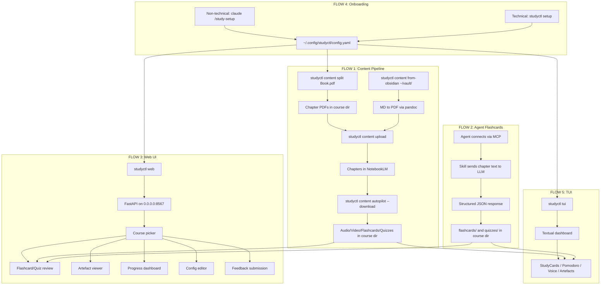
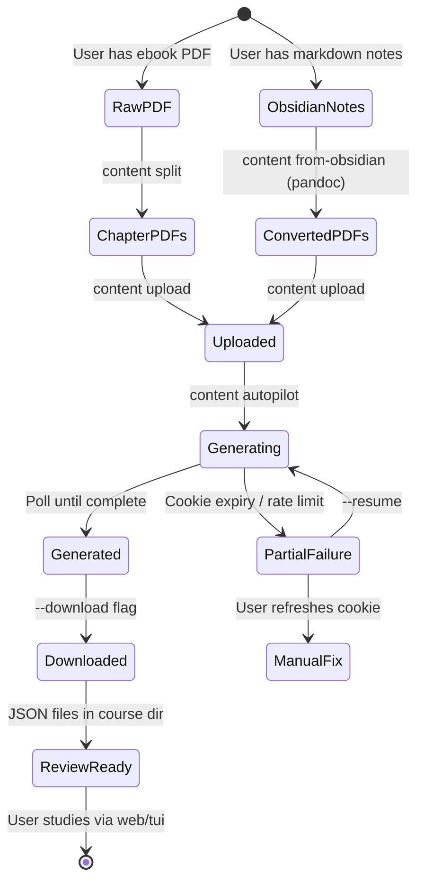

# Unified Study Platform -- Spec Flow Analysis

**Date:** 2026-03-15
**Analyst:** Spec Flow Analyzer Agent
**Scope:** Five proposed flows for merging `notebooklm-pdf-by-chapters` + `Socratic-Study-Mentor` into a unified platform with FastAPI web UI

---

## User Flow Overview

---

## Flow-by-Flow Deep Analysis

### FLOW 1: Content Pipeline

#### 1.1 User Journeys

| # | Journey | Entry Point | Steps | Exit |
|---|---------|-------------|-------|------|
| 1A | PDF Ebook to Audio Podcast | `studyctl content split "Book.pdf"` | split -> upload -> autopilot --download | Audio MP3s in course dir |
| 1B | PDF Ebook to Full Study Materials | `studyctl content split "Book.pdf"` | split -> upload -> autopilot --download (audio+video+flashcards+quizzes) | All artefact types |
| 1C | Obsidian Notes to Study Materials | `studyctl content from-obsidian ~/vault/notes/` | md->PDF -> upload -> generate | Audio + flashcards + quizzes |
| 1D | Resume Interrupted Generation | `studyctl content autopilot --resume` | Skip completed chapters, continue | Remaining artefacts |
| 1E | Re-upload After Note Changes | `studyctl content upload --changed` | Detect changed files, re-upload | Updated NotebookLM sources |

#### 1.2 State Transitions

#### 1.3 Critical Gaps

**GAP-1.1: Course directory structure not specified**
- Where exactly does `content split` write chapter PDFs? The spec says "course-centric directory" but does not define the directory layout.
- Current `pdf-by-chapters` writes to `./chapters/` relative to CWD. The unified tool needs a deterministic, configurable location.
- **Proposed convention needed**: `~/.local/share/studyctl/courses/{book-slug}/chapters/`, `flashcards/`, `quizzes/`, `downloads/`? Or relative to Obsidian vault? Or configurable per-course in config.yaml?

**GAP-1.2: `content split` -- PDF without TOC bookmarks**
- The spec lists this as an edge case but provides no resolution.
- `pdf-by-chapters` uses `PyMuPDF get_toc()` which returns an empty list for PDFs without bookmarks.
- Options: (a) Fail with helpful error, (b) Fall back to page-count-based splitting (every N pages), (c) Use LLM to detect chapter boundaries from text, (d) Allow manual page ranges via `--ranges "1-30,31-60,61-90"`.
- **Impact**: Without this, a significant proportion of technical ebooks (scanned PDFs, older publications) are unsupported.

**GAP-1.3: `content upload` -- NotebookLM authentication model**
- Current `notebooklm-py` uses browser cookies (Secure-1PSID etc.). These expire unpredictably.
- The spec mentions "cookie expiry mid-generation" but does not specify: (a) How the user provides/refreshes cookies initially, (b) How the system detects expiry vs other failures, (c) Whether there is a re-auth prompt or the user must manually update a cookie file.
- The `notebooklm-py` library has no OAuth flow -- it is cookie-based. This is fragile.

**GAP-1.4: `content autopilot` -- Generation failure modes**
- NotebookLM generation is asynchronous and takes 15+ minutes per artefact type per chapter range.
- What happens when: (a) One chapter fails but others succeed? (b) Rate limiting kicks in (daily quota ~20-25 for infographics/slides)? (c) Network drops mid-poll? (d) The process is killed (Ctrl+C) during generation?
- Need: Idempotent resume, per-chapter state tracking, graceful partial completion.

**GAP-1.5: `content from-obsidian` -- External tool dependencies**
- Requires `pandoc`, `mermaid-cli` (mmdc), and `typst` installed.
- What if they are not installed? Currently `pdf-by-chapters` fails with a subprocess error.
- Need: Dependency check at startup with actionable install instructions per platform.

**GAP-1.6: Relationship between `content split` and existing `sync` command**
- The current `studyctl sync` uploads Obsidian notes to NotebookLM.
- `content from-obsidian` does a similar thing but via the pdf-by-chapters pipeline.
- These overlap. Is `sync` being replaced? Deprecated? Running in parallel?
- **Impact**: Users will be confused about which command to use.

**GAP-1.7: Large PDF handling (1000+ pages)**
- Splitting a 1000-page PDF produces potentially 40-80 chapter PDFs.
- NotebookLM has source limits per notebook (currently 50 sources).
- What is the chunking strategy? One notebook per N chapters? Multiple notebooks?
- Memory usage during split: PyMuPDF should handle this, but no streaming is mentioned.

---

### FLOW 2: Agent-Generated Flashcards

#### 2.1 User Journeys

| # | Journey | Actor | Steps | Exit |
|---|---------|-------|-------|------|
| 2A | Agent generates flashcards for a chapter | AI coding agent | Connect MCP -> invoke skill -> LLM generates JSON -> save to course dir | JSON files in flashcards/ |
| 2B | Agent generates quiz for a chapter | AI coding agent | Connect MCP -> invoke skill -> LLM generates JSON -> save to course dir | JSON files in quizzes/ |
| 2C | Agent updates existing flashcards | AI coding agent | Load existing JSON -> merge/update -> save | Updated JSON |
| 2D | User triggers generation from CLI | User | `studyctl content generate-cards --chapter 3` | JSON files |

#### 2.2 Critical Gaps

**GAP-2.1: MCP skill definition not specified**
- What is the MCP tool name? What parameters does it accept?
- What is the input: raw chapter text, chapter PDF path, or chapter identifier?
- What is the output: the JSON file path, or the JSON content?
- Which LLM is used for generation? Is it configurable (Claude, GPT-4, Gemini)?

**GAP-2.2: Flashcard JSON schema validation**
- The current JSON format is defined by convention: `{"title": "...", "cards": [{"front": "...", "back": "..."}]}` for flashcards, `{"title": "...", "questions": [{"question": "...", "answerOptions": [...]}]}` for quizzes.
- No JSON Schema file exists. No validation on load (just try/except).
- LLMs produce malformed JSON frequently. What happens when: (a) The JSON is syntactically invalid? (b) The JSON is valid but missing required fields? (c) The "isCorrect" field is missing from quiz options? (d) Multiple options are marked correct?
- Need: A formal JSON Schema, validation on write (from agent), graceful degradation on read.

**GAP-2.3: Card deduplication and versioning**
- If the agent generates flashcards for the same chapter twice, what happens?
- Current loader globs `*flashcards.json` -- duplicate files means duplicate cards.
- The `card_hash` is `sha256(front_text)[:16]` -- so identical front text deduplicates in SM-2 tracking, but the card still appears twice in the deck.
- Need: File naming convention that prevents duplicates, or a merge strategy.

**GAP-2.4: Chapter text extraction**
- The skill "sends chapter text to LLM" but how is chapter text extracted from the PDF?
- Is this PyMuPDF text extraction? OCR for scanned PDFs? What about images, diagrams, code blocks?
- Character limits for LLM context windows -- a 30-page chapter might be 15,000+ tokens.

**GAP-2.5: Quality control**
- Generated flashcards may be low quality (too vague, factually wrong, trivial).
- Is there a review/approval step? Or are they immediately available for study?
- The `docs/research/flashcards-wrong-answers-best-practices.md` exists -- has this been incorporated?

---

### FLOW 3: Web UI Study Session

#### 3.1 User Journeys

| # | Journey | Steps | Exit |
|---|---------|-------|------|
| 3A | Quick flashcard session | web -> course picker -> flashcards -> flip/rate cards -> session summary | Return to courses |
| 3B | Quiz session | web -> course picker -> quiz -> answer questions -> session summary | Return to courses |
| 3C | Due cards review | web -> course picker (due badge) -> due cards only -> review -> summary | Return to courses |
| 3D | Wrong answer retry | Session summary -> "Review wrong answers" -> retry session (SM-2 skipped) | Return to courses |
| 3E | Filtered study | web -> course picker -> select source/chapter -> filtered session | Return to courses |
| 3F | Artefact playback | web -> course -> artefact viewer -> play audio/video | Return to course |
| 3G | Progress check | web -> dashboard -> heatmap + history + stats | Stay on dashboard |
| 3H | Config edit | web -> settings -> update config.yaml | Saved config |
| 3I | Bug report | web -> feedback -> submit issue | GitHub issue created |

#### 3.2 Current State vs Spec

The web UI already exists as a stdlib `http.server` implementation (not FastAPI). Key findings:

| Spec Requirement | Current State | Gap |
|-----------------|---------------|-----|
| FastAPI on 0.0.0.0:8567 | stdlib HTTPServer on 0.0.0.0:8567 | **Major**: Spec says FastAPI, implementation is stdlib. Which is the plan? |
| `--password` LAN auth | Not implemented | **Missing entirely** |
| Artefact viewer (audio, video, PDF, infographic) | Not implemented | **Missing entirely** |
| Config editor | Not implemented | **Missing entirely** |
| Feedback -> GitHub Issues | Not implemented | **Missing entirely** |
| Flashcard review + SM-2 | Implemented | Working |
| Quiz review | Implemented | Working |
| Progress dashboard + heatmap | Implemented | Working |
| Pomodoro timer | Implemented | Working |
| Voice (Web Speech API) | Implemented | Working |
| PWA + service worker | Implemented | Working |
| OpenDyslexic toggle | Implemented | Working |
| Dark/light theme | Implemented | Working |

#### 3.3 Critical Gaps

**GAP-3.1: FastAPI vs stdlib -- architectural decision needed**
- The spec says "FastAPI starts on 0.0.0.0:8567" but the current implementation is `http.server.HTTPServer`.
- FastAPI requires `uvicorn` as an ASGI server, adding a dependency.
- The current implementation deliberately avoids external dependencies ("no external dependencies" per docstring).
- **Decision needed**: Migrate to FastAPI (adds deps, gains async, middleware, validation, OpenAPI docs) or stay with stdlib (zero deps, simpler, already working)?
- If FastAPI: this is a rewrite of server.py, not an enhancement.

**GAP-3.2: `--password` LAN authentication -- design not specified**
- What authentication scheme? Basic Auth? Token-based? Session cookie?
- Where is the password stored? In config.yaml? As a CLI argument only (ephemeral)?
- Is it per-session or persistent?
- What happens when an unauthenticated user accesses the UI? Redirect to login page? 401?
- Can the password be changed from the config editor (circular dependency if so)?
- Is HTTPS required for password security on LAN? (HTTP sends credentials in cleartext.)

**GAP-3.3: Artefact viewer -- file serving and security**
- Audio/video/PDF/infographic files are on the local filesystem.
- The web server needs to serve these files. Currently it only serves from `STATIC_DIR`.
- Need: A route like `/api/artefacts/{course}/{filename}` that serves from the course directory.
- **Security**: This creates a file serving endpoint. Without path validation, it is a directory traversal vulnerability. Need strict path validation (no `../`, must be within configured course directories).
- What file formats are supported? MP3, MP4, PDF, PNG/JPEG? What about WebM, OGG?
- How large are video files? Streaming (Range header support) is needed for large videos.

**GAP-3.4: Config editor -- scope and safety**
- Which config values are editable from the UI? All of config.yaml? A subset?
- Editing config.yaml from the web UI while the server is running: does the server hot-reload config?
- What validation is performed on edits? (e.g., user enters an invalid path)
- Concurrent editing: what if two LAN users edit config simultaneously?
- **Security**: A config editor accessible over LAN is a significant attack surface. An attacker on the LAN could change `session_db` to point to a malicious path, or modify `sync_remote` to exfiltrate data.

**GAP-3.5: GitHub Issues feedback -- authentication**
- The GitHub Issues API requires authentication (personal access token).
- Where is the token stored? In config.yaml? In `.env`?
- What is the issue template? Title, body, labels?
- What happens if the token is missing or expired? Graceful fallback?
- Rate limiting: GitHub API has rate limits (60 unauthenticated, 5000 authenticated per hour).

**GAP-3.6: Multiple users on LAN -- data conflicts**
- The spec mentions this edge case but provides no resolution.
- The SQLite database is at `~/.config/studyctl/sessions.db` on the server machine.
- Multiple concurrent HTTP requests from different browsers all write to the same DB.
- SQLite handles concurrent reads well but has write contention with WAL mode.
- Is WAL mode enabled? Current code does `sqlite3.connect(path)` without `PRAGMA journal_mode=WAL`.
- SM-2 calculations are non-atomic: read previous review, compute new interval, insert. A race condition between two users reviewing the same card could produce incorrect intervals.
- **Bigger question**: Is this a single-user tool being used on LAN for convenience (e.g., phone + laptop), or a genuinely multi-user tool? The SM-2 tracking has no user_id column.

**GAP-3.7: Service worker cache invalidation**
- Current `sw.js` caches static assets (`/`, `/style.css`, `/app.js`, `/manifest.json`).
- API calls (`/api/*`) bypass the cache.
- But the cache version is hardcoded as `studyctl-v1`. After a software update, users get stale cached assets until the service worker updates.
- Need: Cache busting strategy (version bump, or content-hash filenames).

---

### FLOW 4: Onboarding

#### 4.1 User Journeys

| # | Journey | Actor | Entry | Steps | Exit |
|---|---------|-------|-------|-------|------|
| 4A | Non-technical onboarding | New user + Claude Code | `claude /study-setup` | Agent asks questions conversationally -> writes config.yaml | Ready to use |
| 4B | Technical onboarding | Developer | `studyctl setup` | Interactive CLI wizard -> writes config.yaml | Ready to use |
| 4C | Existing user migration | User with pdf-by-chapters | Unknown | Migrate existing courses/notebooks | Unified config |
| 4D | Re-onboarding | User changing settings | `studyctl setup` or `studyctl config init` | Update existing config | Updated config |

#### 4.2 Critical Gaps

**GAP-4.1: `studyctl setup` vs `studyctl config init` -- naming collision**
- The spec says onboarding uses `studyctl setup`.
- The current codebase has `studyctl config init` which already does interactive setup.
- Are these the same command? Different? Is `setup` an alias for `config init`?
- The README documents `studyctl config init`. Changing the command name breaks docs and muscle memory.

**GAP-4.2: `claude /study-setup` -- agent skill definition**
- What does this agent skill do that `studyctl config init` does not?
- Does it call `studyctl config init` under the hood, or write config.yaml directly?
- What questions does it ask? The current `config init` asks about: knowledge bridging, NotebookLM integration, Obsidian vault path.
- The spec says "conversational" -- does it detect the user's study goals and suggest topics?
- How does it handle errors (e.g., user provides a path that does not exist)?

**GAP-4.3: Migration from `pdf-by-chapters`**
- Users of the standalone `pdf-by-chapters` tool have: courses in arbitrary directories, notebook IDs in their shell history/notes, generated artefacts in `./downloads/`.
- How do they migrate? Is there a `studyctl migrate --from-pdf-by-chapters`?
- What about the `pdf-by-chapters` config (if any)?
- If not addressed, existing users will have two tools and not know which to use.

**GAP-4.4: First-run experience without config**
- What happens when a user runs `studyctl web` or `studyctl tui` without having run setup?
- Currently the TUI reads config.yaml and falls back to empty defaults.
- The web UI shows "No courses found" with config instructions.
- Should the tool auto-detect and offer to run setup? Or just show the empty state?

**GAP-4.5: Config schema versioning**
- The unified platform adds new config sections (content pipeline paths, web auth, etc.).
- Old config.yaml files from pre-merge installations will lack these sections.
- Is there a config migration mechanism? Schema version field?
- What happens when new code reads old config? Silent defaults? Warning?

---

### FLOW 5: TUI Study Session

#### 5.1 Current State

The TUI is already well-implemented with:
- StudyCards tab with flashcard/quiz review
- Spaced repetition tracking
- Voice output via study-speak
- OpenDyslexic font toggle
- Pomodoro timer (from experimental modules)
- Concept graph viewer
- Progress dashboard (struggles, wins, due reviews)

#### 5.2 Gaps Specific to Unified Platform

**GAP-5.1: Artefact browser in TUI**
- The spec mentions "artefact browser" in TUI but the current TUI has no artefact playback.
- Playing audio in a Textual TUI requires spawning an external player (e.g., `afplay` on macOS, `mpv`, `ffplay`).
- PDF viewing in terminal: not feasible. Open in external viewer?
- Video: same as audio, external player.
- This is fundamentally different from the web UI where the browser handles media natively.

**GAP-5.2: TUI and Web UI feature parity**
- The spec implies both UIs offer similar features. But their capabilities differ fundamentally:
  - Web: native media playback, heatmap visualisation, config editor
  - TUI: keyboard-driven, tmux-friendly, no media playback
- Need: Clear statement of which features are web-only, TUI-only, or both.

---

## Flow Permutations Matrix

### Content Pipeline Permutations

| Dimension | Variations | Current Handling |
|-----------|-----------|------------------|
| PDF type | Has TOC bookmarks / No bookmarks / Scanned (images only) / Password protected | Only TOC bookmarks handled |
| PDF size | Small (<100 pages) / Medium (100-500) / Large (500-1000) / Huge (1000+) | Not differentiated |
| Source type | PDF ebook / Obsidian markdown / Mixed | PDF and markdown separate paths |
| NotebookLM state | Authenticated / Cookie expired / Rate limited / Service down | No error differentiation |
| Generation scope | Audio only / Video only / All artefact types / Flashcards only | `--no-video` flag exists in pdf-by-chapters |
| Resume state | Fresh start / Partial completion / All complete | `--resume` mentioned but not specified |
| Network | Online / Slow / Intermittent / Offline | No offline handling for pipeline |
| Disk space | Ample / Low / Full | No space checks |

### Web UI Permutations

| Dimension | Variations | Current Handling |
|-----------|-----------|------------------|
| User auth | No password / Password set / Wrong password | Not implemented |
| Device | Desktop browser / Mobile browser / Tablet / PWA installed | Responsive CSS exists |
| Courses | No courses / One course / Many courses / Course with 0 cards | Empty state handled |
| Session | First time / Returning (has history) / Due cards available | Due badge implemented |
| Concurrent | Single user / Same user multi-device / Multiple users | No multi-user support |
| Network | Online / Offline (PWA cache) / Server stops mid-session | Basic SW cache only |
| Browser | Chrome / Firefox / Safari / Safari iOS | Not tested cross-browser |

### Onboarding Permutations

| Dimension | Variations | Current Handling |
|-----------|-----------|------------------|
| User type | Non-technical (agent) / Technical (CLI) | Both paths proposed |
| Prior state | Fresh install / Existing config / Migrating from pdf-by-chapters | Only fresh/existing |
| Dependencies | All installed / Missing pandoc / Missing notebooklm-py / Missing textual | Partial import guards |
| Platform | macOS / Linux / WSL | macOS primary, Linux secondary |
| Agent CLI | Claude Code / Gemini / Kiro / None installed | Not differentiated for setup |

---

## Missing Elements and Gaps Summary

### Category: Data Architecture

| ID | Gap | Impact | Priority |
|----|-----|--------|----------|
| DA-1 | Course directory structure not defined | Developers cannot implement content pipeline without knowing where files go | Critical |
| DA-2 | No formal JSON Schema for flashcard/quiz format | LLM-generated content may be malformed, causing runtime errors | Critical |
| DA-3 | card_reviews has no user_id column | Multi-user LAN access creates merged/conflicted SM-2 data | Important |
| DA-4 | Config schema versioning absent | Old configs break silently on upgrade | Important |
| DA-5 | No content manifest or pipeline state file defined | Cannot implement resume/idempotency | Critical |

### Category: Security

| ID | Gap | Impact | Priority |
|----|-----|--------|----------|
| SE-1 | LAN auth scheme not specified | Cannot implement `--password` flag | Critical |
| SE-2 | Artefact file serving creates directory traversal risk | Attacker on LAN reads arbitrary files | Critical |
| SE-3 | Config editor over LAN allows remote config modification | Attacker can alter DB paths, sync targets | Important |
| SE-4 | GitHub token storage not specified | Feedback feature cannot be implemented | Important |
| SE-5 | HTTP-only serving sends password in cleartext on LAN | Password can be sniffed on WiFi | Important |

### Category: Error Handling

| ID | Gap | Impact | Priority |
|----|-----|--------|----------|
| EH-1 | NotebookLM cookie expiry detection and recovery | User stuck when generation fails mid-pipeline | Critical |
| EH-2 | PDF without TOC -- no fallback strategy | Common ebooks rejected with unhelpful error | Important |
| EH-3 | External tool dependency checking (pandoc, mmdc, typst) | Confusing subprocess errors | Important |
| EH-4 | Rate limit handling for NotebookLM (daily quota ~20-25) | Silent failures during autopilot | Important |
| EH-5 | Large PDF memory/time handling | Process killed by OOM or user gives up | Nice-to-have |

### Category: State Management

| ID | Gap | Impact | Priority |
|----|-----|--------|----------|
| SM-1 | Pipeline state persistence for resume/idempotency | Cannot resume interrupted autopilot | Critical |
| SM-2 | SQLite WAL mode not enabled | Write contention with concurrent web requests | Important |
| SM-3 | Service worker cache invalidation strategy | Users get stale UI after updates | Important |
| SM-4 | Cross-machine sync for content pipeline data (course dirs, artefacts) | Only sessions.db syncs, not study materials | Important |

### Category: UX and Integration

| ID | Gap | Impact | Priority |
|----|-----|--------|----------|
| UX-1 | `studyctl setup` vs `studyctl config init` naming | User confusion, doc inconsistency | Important |
| UX-2 | `content from-obsidian` vs `sync` command overlap | Users do not know which to use | Important |
| UX-3 | TUI artefact browser feasibility (terminal media playback) | Feature may be unimplementable as described | Important |
| UX-4 | Migration path from standalone pdf-by-chapters | Existing users abandoned | Important |
| UX-5 | Web/TUI feature parity expectations not set | Users expect features that do not exist in their chosen UI | Nice-to-have |

---

## Critical Questions Requiring Clarification

### Priority 1: Critical (blocks implementation or creates security/data risks)

**Q1. What is the canonical course directory structure?**
Where does each pipeline step write its output? The entire content pipeline, agent flashcard generation, web UI, and TUI all need to agree on where files live. Without this, nothing integrates.
- *If unanswered*: I would assume `~/.local/share/studyctl/courses/{slug}/` with subdirs `chapters/`, `flashcards/`, `quizzes/`, `downloads/` (audio/video/infographic).
- *Example ambiguity*: User runs `studyctl content split "Clean-Code.pdf"` -- does it create `~/.local/share/studyctl/courses/clean-code/chapters/` or `./clean-code/chapters/` in CWD?

**Q2. FastAPI or stdlib http.server?**
The spec says FastAPI. The implementation uses stdlib with zero dependencies. Which is the target? This is a fork-in-the-road decision that affects every subsequent web feature.
- *If unanswered*: I would keep stdlib (already working, zero deps) and add the missing features incrementally.
- *Impact*: FastAPI means rewriting server.py, adding uvicorn + fastapi to dependencies, and potentially breaking the "optional dependency" model (web UI currently requires no extras).

**Q3. How does `--password` authentication work?**
What auth scheme (Basic Auth, session cookie, bearer token)? Where is the password stored (CLI arg only, config.yaml, environment variable)? Is HTTPS required?
- *If unanswered*: I would implement HTTP Basic Auth with the password as a CLI argument only (not persisted), with a warning that HTTP sends credentials in cleartext.
- *Example*: `studyctl web --password mysecret` -- user accesses http://192.168.1.10:8567 from phone, browser prompts for password.

**Q4. What is the pipeline state persistence format?**
The `autopilot` command needs to track which chapters have been uploaded, which artefacts have been generated, and which have been downloaded. What is the state file format and location?
- *If unanswered*: I would assume a `.pipeline-state.json` in the course directory (similar to the existing `docs/artefacts/.pipeline-state.json`).
- *Impact*: Without this, `--resume` cannot be implemented, and any interruption requires starting over.

**Q5. How is artefact file serving secured against directory traversal?**
The web server needs to serve audio/video/PDF files from course directories. How do we prevent path traversal attacks?
- *If unanswered*: I would implement strict allowlisting: resolve the requested path, verify it is a child of a configured course directory, reject anything else.

**Q6. What is the MCP skill definition for flashcard generation?**
Tool name, parameters, input format, output format, which LLM, error handling.
- *If unanswered*: Cannot implement Flow 2 at all.

### Priority 2: Important (significantly affects UX or maintainability)

**Q7. What happens when a PDF has no TOC bookmarks?**
Fail with error? Fallback to page-based splitting? Prompt user for manual ranges?
- *If unanswered*: Fail with a clear error message and suggest `--ranges` flag for manual specification.

**Q8. Is `studyctl sync` being replaced by `studyctl content from-obsidian`?**
They have significant overlap (both sync Obsidian notes to NotebookLM). Having both creates confusion.
- *If unanswered*: I would deprecate `sync` in favour of the unified `content` subcommand group.

**Q9. Is this a single-user or multi-user tool?**
The LAN access feature suggests multi-user, but there is no user_id anywhere in the data model.
- *If unanswered*: I would assume single-user (same person on multiple devices), and document this explicitly.

**Q10. What is the migration story for existing pdf-by-chapters users?**
How do they bring existing courses, notebooks, and generated artefacts into the unified tool?
- *If unanswered*: I would add a `studyctl migrate --from-pdf-by-chapters <dir>` command that copies/links artefacts into the new course structure.

**Q11. How does cross-machine sync work for content pipeline data?**
Currently only `sessions.db` and `state.json` sync via SSH/rsync. Course directories with PDFs, audio, and video can be gigabytes.
- *If unanswered*: I would sync only metadata (pipeline state, flashcard/quiz JSON) and not media files. Each machine runs its own generation.

**Q12. How does the config editor handle concurrent access and validation?**
What config fields are editable? How are invalid values rejected? What about concurrent edits?
- *If unanswered*: I would scope the config editor to safe fields only (review directories, theme, TUI preferences) and use file locking.

### Priority 3: Nice-to-have (improves clarity but has reasonable defaults)

**Q13. Should the TUI artefact browser open external players or embed playback?**
Terminal-based media playback is extremely limited. External players work but break the tmux split workflow.
- *If unanswered*: External players via `open` (macOS) / `xdg-open` (Linux).

**Q14. What is the service worker cache busting strategy?**
Version bump manually? Content-hash filenames? No-cache for app shell?
- *If unanswered*: Bump the CACHE version string in sw.js on each release.

**Q15. Should generated flashcards/quizzes go through a review/approval step?**
Or are they immediately available for study?
- *If unanswered*: Immediately available, with a "flag bad card" feature for later cleanup.

**Q16. What cross-browser testing is required for the PWA?**
Chrome, Firefox, Safari, Safari iOS? PWA install on Android vs iOS?
- *If unanswered*: Chrome + Safari (iOS) as primary targets.

---

## Recommended Next Steps

### Immediate (before implementation)

1. **Define course directory structure** (Q1) -- This is the integration contract between all five flows. Write it as an ADR.

2. **Decide FastAPI vs stdlib** (Q2) -- This determines the server architecture for all web features. Given the current working stdlib implementation and the zero-dependency philosophy, I would challenge the FastAPI requirement: what does FastAPI give you that stdlib does not? If the answer is "middleware for auth and validation," consider whether a thin wrapper around stdlib achieves the same with fewer dependencies.

3. **Design the authentication scheme** (Q3) -- Before building the config editor or feedback features.

4. **Write a JSON Schema for flashcard/quiz format** -- This is the contract between the content pipeline, agent skills, and review UIs. Formalize it.

5. **Define the MCP skill interface** (Q6) -- Without this, Flow 2 cannot be designed, let alone implemented.

### Short-term (during implementation)

6. **Implement pipeline state persistence** -- `.pipeline-state.json` per course with chapter-level tracking.

7. **Add WAL mode to SQLite connections** -- One-line fix: `conn.execute("PRAGMA journal_mode=WAL")` after connect.

8. **Add path validation for artefact serving** -- Before exposing any file-serving endpoint.

9. **Resolve sync vs content command overlap** -- Deprecation notice or rename.

10. **Add dependency checks** -- At startup of content pipeline commands, verify pandoc/mmdc/typst are installed.

### Medium-term (post-merge)

11. **Add PDF-without-TOC fallback** -- Page-based splitting with `--ranges` flag.

12. **Add config migration** -- Schema version field, upgrade on load.

13. **Add pdf-by-chapters migration command** -- For existing users.

14. **Cross-browser testing** -- Particularly Safari iOS PWA behaviour.

15. **Document feature parity matrix** -- What works in web vs TUI vs CLI.

---

## Appendix: Existing Code References

| Component | File Path | Relevance |
|-----------|-----------|-----------|
| Web server | `packages/studyctl/src/studyctl/web/server.py` | Current stdlib implementation, all API routes |
| Review DB (SM-2) | `packages/studyctl/src/studyctl/review_db.py` | Card reviews, spaced repetition, session recording |
| Review loader | `packages/studyctl/src/studyctl/review_loader.py` | JSON format contract, directory discovery |
| TUI app | `packages/studyctl/src/studyctl/tui/app.py` | Current TUI dashboard |
| TUI study cards | `packages/studyctl/src/studyctl/tui/study_cards.py` | Flashcard/quiz review in TUI |
| CLI entry point | `packages/studyctl/src/studyctl/cli.py` | All current CLI commands |
| Settings | `packages/studyctl/src/studyctl/settings.py` | Config loading and schema |
| Cross-machine sync | `packages/studyctl/src/studyctl/shared.py` | SSH/rsync state sync |
| Obsidian sync | `packages/studyctl/src/studyctl/sync.py` | Current NotebookLM sync engine |
| Config path | `packages/studyctl/src/studyctl/config_path.py` | DB path resolution |
| pdf-by-chapters analysis | `docs/research/notebooklm-pdf-by-chapters-analysis.md` | Integration points and user journeys |
| Architecture review | `.claude/handoffs/2026-03-15-architecture-review-implementation-plan.md` | Schema ownership, migration safety |
| Code review items | `code-review-plan-items.md` | Known bugs in get_due_cards SQL, connection patterns |
| Native app handoff | `.claude/handoffs/2026-03-15-180000-native-app-handoff.md` | JSON format contract, architecture decisions |
