# Architecture Review: Socratic Study Mentor

> Date: 2026-04-03
> Scope: Current state vs target state, code quality, architectural gaps, recommendations
> Corpus: 799+ tests, 2 packages (studyctl + agent-session-tools), monorepo

---

## Executive Summary

Socratic Study Mentor is a mature, well-structured monorepo with two independently publishable packages. The project has evolved from a collection of study scripts into a cohesive platform with CLI, TUI, web PWA, MCP server, and multi-agent support. The FCIS (Functional Core, Imperative Shell) pattern is applied consistently, test coverage is exceptional, and the documentation is thorough.

**Key findings:**
- **Monorepo structure is clean** — two packages with clear boundaries, workspace-aware tooling
- **FCIS pattern is the strongest architectural choice** — pure functions in `_clean_logic.py`, `backlog_logic.py` with zero-mock tests
- **Web layer has proper router separation** — unlike mailgraph, routes are already split into `web/routes/`
- **Service layer is partially wired** — `services/review.py` and `services/content.py` exist but not all consumers use them
- **Agent framework is well-designed** — `agents/shared/` eliminates ~700 lines of duplication
- **Compaction was the right call** — roadmap shows clear focus on 4 core features after stripping bloat

---

## 1. Architecture: Current vs Target

### 1.1 What Was Planned vs What Exists

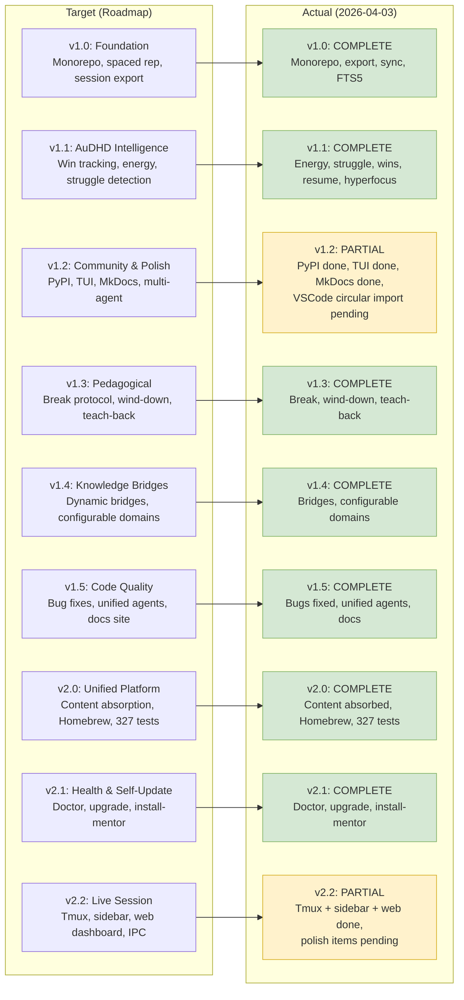

| Version | Planned | Actual | Gap |
|---------|---------|--------|-----|
| **v1.0** | Monorepo, spaced rep, session export, FTS5, sync | **Complete** | None |
| **v1.1** | Win tracking, energy-adaptive, struggle detection, resume, hyperfocus, calendar | **Complete** | None |
| **v1.2** | PyPI, TUI, MkDocs, multi-agent, VSCode, watchdog | **Partial** — VSCode circular import, watchdog not done | Minor |
| **v1.3** | Break protocol, wind-down, teach-back | **Complete** | None |
| **v1.4** | Knowledge bridges, configurable domains | **Complete** | None |
| **v1.5** | Bug fixes, unified agents, docs site | **Complete** | None |
| **v2.0** | Content absorption, Homebrew, 327 tests | **Complete** | None |
| **v2.1** | Doctor, upgrade, install-mentor | **Complete** | None |
| **v2.2** | Tmux, sidebar, web dashboard, IPC | **Partial** — core done, polish pending | Break suggestions, energy streaks, tmux-resurrect compat |

### 1.2 Layer Architecture

```mermaid
flowchart TD
    subgraph "Presentation Layer"
        CLI_CLI["CLI (Click)\ncli/_study.py, _topics.py,\n_clean.py, _doctor.py, etc."]
        CLI_TUI["TUI (Textual)\ntui/sidebar.py"]
        CLI_WEB["Web (FastAPI + HTMX)\nweb/app.py, web/routes/"]
        CLI_MCP["MCP Server (FastMCP stdio)\nmcp/server.py, mcp/tools.py"]
    end

    subgraph "Service Layer"
        SVC_REVIEW["services/review.py\nSpaced repetition logic"]
        SVC_CONTENT["services/content.py\nContent pipeline orchestration"]
    end

    subgraph "FCIS Cores (Functional Core)"
        FCIS_CLEAN["_clean_logic.py\nplan_clean()"]
        FCIS_BACKLOG["backlog_logic.py\nformat, score, persist"]
    end

    subgraph "Data Layer"
        DATA_PARKING["parking.py\nParked topics CRUD"]
        DATA_HISTORY["history.py\nSession CRUD + FTS5"]
        DATA_STATE["session_state.py\nIPC file protocol"]
        DATA_REVIEW["review_db.py\nSM-2 spaced repetition"]
        DATA_TMUX["tmux.py\nSession management"]
    end

    subgraph "Doctor Package"
        DOC_CORE["doctor/core.py"]
        DOC_CONFIG["doctor/config.py"]
        DOC_DATABASE["doctor/database.py"]
        DOC_AGENTS["doctor/agents.py"]
        DOC_DEPS["doctor/deps.py"]
        DOC_UPDATES["doctor/updates.py"]
        DOC_MODELS["doctor/models.py"]
    end

    subgraph "Content Package"
        CNT_SPLITTER["content/splitter.py"]
        CNT_NLM["content/notebooklm_client.py"]
        CNT_SYLLABUS["content/syllabus.py"]
        CNT_STORAGE["content/storage.py"]
        CNT_MODELS["content/models.py"]
    end

    subgraph "External Systems"
        TMUX_EXT["tmux"]
        NLM_EXT["NotebookLM API"]
        AGENT_EXT["Claude Code, Kiro, Gemini, OpenCode"]
        SQLITE_DB[("sessions.db\nSQLite WAL v17")]
        REVIEW_DB[("review.db\nSM-2")]
    end

    CLI_CLI --> FCIS_CLEAN
    CLI_CLI --> FCIS_BACKLOG
    CLI_CLI --> DATA_PARKING
    CLI_CLI --> DATA_HISTORY
    CLI_CLI --> DATA_STATE
    CLI_CLI --> DATA_TMUX
    CLI_CLI --> DOC_CORE
    CLI_CLI --> SVC_CONTENT
    CLI_CLI --> SVC_REVIEW

    CLI_TUI --> DATA_STATE
    CLI_TUI --> FCIS_CLEAN

    CLI_WEB --> DATA_STATE
    CLI_WEB --> DATA_HISTORY
    CLI_WEB --> SVC_CONTENT
    CLI_WEB --> SVC_REVIEW

    CLI_MCP --> FCIS_BACKLOG
    CLI_MCP --> DATA_PARKING
    CLI_MCP --> DATA_HISTORY

    FCIS_CLEAN --> DATA_TMUX
    FCIS_BACKLOG --> DATA_PARKING

    DATA_PARKING --> SQLITE_DB
    DATA_HISTORY --> SQLITE_DB
    DATA_REVIEW --> REVIEW_DB

    SVC_CONTENT --> CNT_SPLITTER
    SVC_CONTENT --> CNT_NLM
    SVC_CONTENT --> CNT_STORAGE

    DOC_CORE --> DOC_CONFIG
    DOC_CORE --> DOC_DATABASE
    DOC_CORE --> DOC_AGENTS
    DOC_CORE --> DOC_DEPS
    DOC_CORE --> DOC_UPDATES

    DOC_DATABASE --> SQLITE_DB
    DOC_DATABASE --> REVIEW_DB

    style CLI_CLI fill:#e1d5e7,stroke:#9673a6
    style CLI_TUI fill:#e1d5e7,stroke:#9673a6
    style CLI_WEB fill:#e1d5e7,stroke:#9673a6
    style CLI_MCP fill:#e1d5e7,stroke:#9673a6
    style FCIS_CLEAN fill:#d5e8d4,stroke:#82b366
    style FCIS_BACKLOG fill:#d5e8d4,stroke:#82b366
    style SVC_REVIEW fill:#dae8fc,stroke:#6c8ebf
    style SVC_CONTENT fill:#dae8fc,stroke:#6c8ebf
```

**Legend**: Purple = presentation, Green = functional core, Blue = service layer

---

## 2. Key Architectural Strengths

### 2.1 FCIS Pattern — The Standout Feature

The Functional Core, Imperative Shell pattern is applied consistently and correctly:

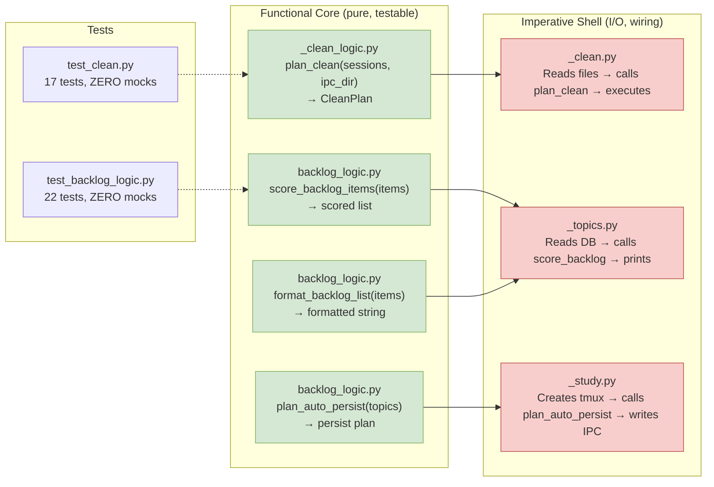

**Why this matters**: Pure functions are trivially testable. `test_clean.py` has 17 tests with zero mocks because `plan_clean()` takes data structures and returns a plan — no I/O. This is the gold standard for testability.

### 2.2 Web Layer — Already Has Router Separation

Unlike mailgraph, the web layer is properly structured:

```
web/
├── app.py              # FastAPI factory, lifespan, middleware
├── routes/
│   ├── __init__.py
│   ├── session.py      # /session, /session/api/*
│   ├── history.py      # /history
│   ├── courses.py      # /courses
│   ├── cards.py        # /cards (flashcards)
│   └── artefacts.py    # /artefacts
└── static/             # HTML, CSS, JS, vendor/
```

This is the pattern mailgraph should adopt.

### 2.3 Agent Framework — Shared Definitions

The `agents/shared/` directory eliminates ~700 lines of duplication:

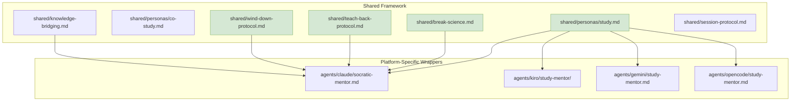

### 2.4 IPC File Protocol — Clean Separation

The IPC file protocol (`session-state.json`, `session-topics.md`, `session-parking.md`) is a clean way to share state between the tmux agent, sidebar TUI, and web dashboard without requiring a running server:

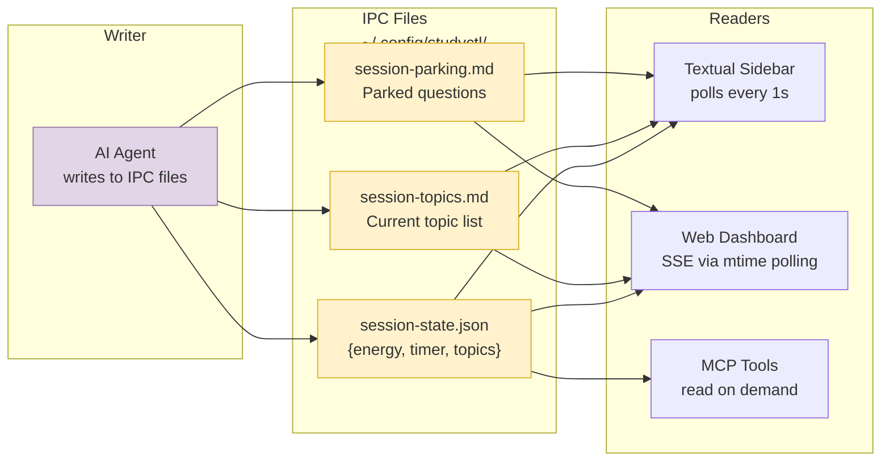

**Tradeoff**: File-based polling instead of a message queue. For a single-user tool, this is the right choice — simpler, no additional process, works offline.

---

## 3. Architectural Issues

### 3.1 Service Layer — Partially Wired

**Problem**: `services/review.py` and `services/content.py` exist but not all consumers use them.

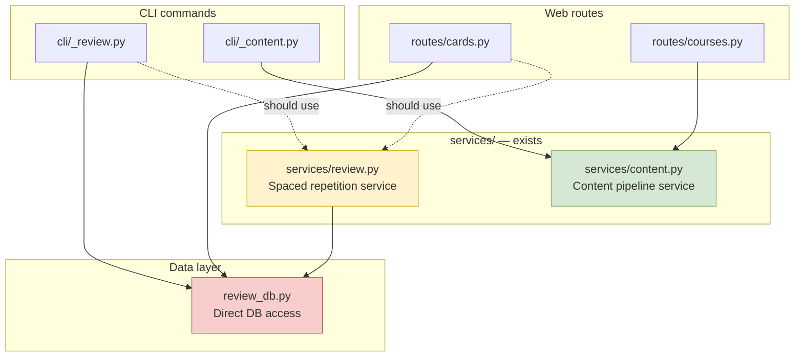

**Impact**: `cli/_review.py` and `routes/cards.py` both access `review_db.py` directly, duplicating the data access pattern. The service layer should be the single point of access.

**Fix**: Route all review/card access through `services/review.py`.

### 3.2 Two SQLite Databases — sessions.db + review.db

**Problem**: Two separate SQLite databases with no cross-database queries.

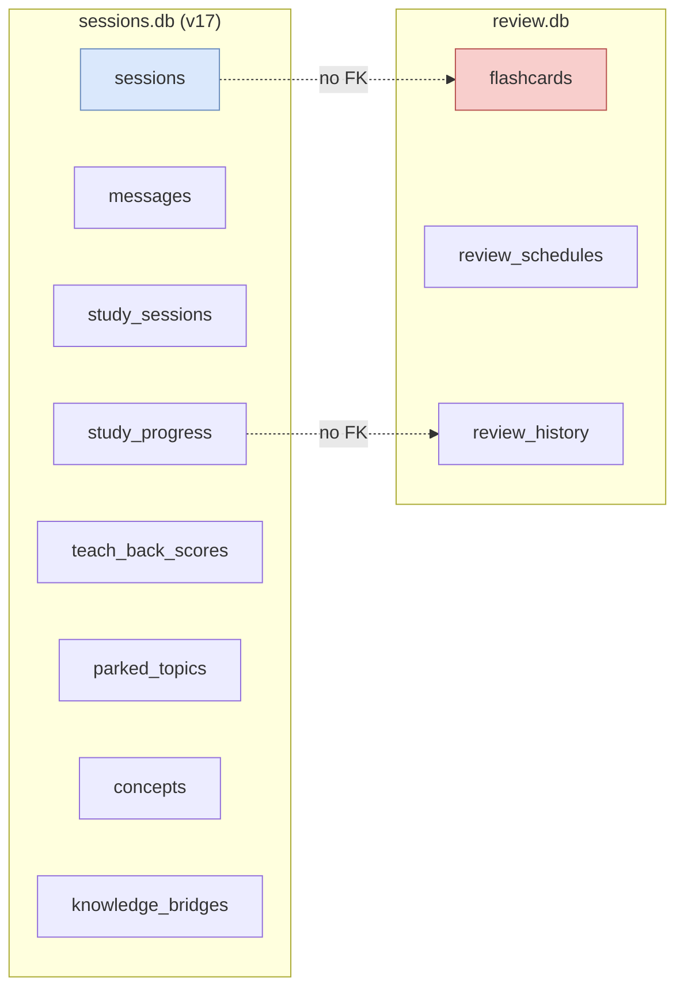

**Tradeoff analysis**:
- **Pro**: Separation of concerns — session tracking vs spaced repetition are independent lifecycles
- **Pro**: review.db can be synced independently via `session-sync`
- **Con**: Can't query "show flashcards for topics I struggled with in sessions"
- **Con**: Two database connections to manage

**Recommendation**: Keep separate for now. The separation is intentional and correct. If cross-database queries become needed, use SQLite's `ATTACH DATABASE` rather than merging.

### 3.3 CLI Module Naming — Inconsistent Prefixes

**Problem**: CLI modules use `_` prefix inconsistently:

```
cli/_study.py        # underscore (private-ish)
cli/_topics.py       # underscore
cli/_clean.py        # underscore
cli/_clean_logic.py  # underscore (but this is FCIS core, not CLI)
cli/_doctor.py       # underscore
cli/_review.py       # underscore
cli/_session.py      # underscore
cli/_web.py          # underscore
cli/_shared.py       # underscore
cli/_setup.py        # underscore
cli/_config.py       # underscore
cli/_content.py      # underscore
cli/_sync.py         # underscore
cli/_upgrade.py      # underscore
cli/_lazy.py         # underscore (LazyGroup implementation)
```

**Issue**: `_clean_logic.py` is not a CLI module — it's an FCIS core function. It shouldn't be in `cli/` at all.

**Recommended structure**:

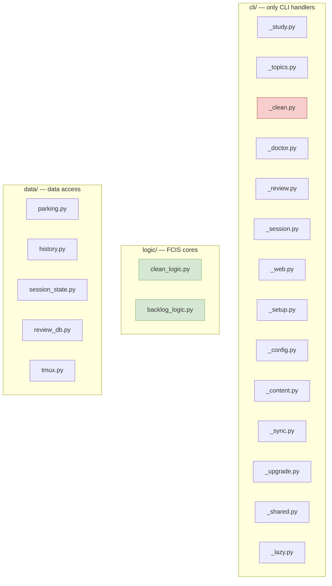

### 3.4 `settings.py` vs `config_loader.py` — Two Config Systems

**Problem**: `studyctl/settings.py` and `agent-session-tools/config_loader.py` are two different config systems in the same monorepo.

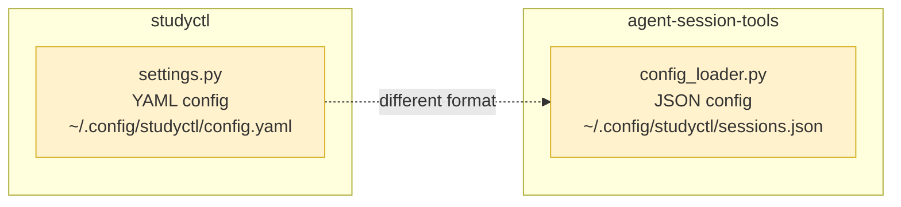

**Impact**: Users configure studyctl via YAML but agent-session-tools via JSON. Different paths, different formats.

**Recommendation**: Unify under a single config system. The YAML approach in `settings.py` is better (structured, supports comments). Migrate `config_loader.py` to use the same YAML format.

### 3.5 Web Dashboard — SSE via mtime Polling

**Problem**: The web dashboard uses file modification time polling for SSE, not true push:

```python
# web/routes/session.py — SSE endpoint
async def session_events():
    while True:
        mtime = os.path.getmtime(ipc_file)
        if mtime != last_mtime:
            yield f"data: {json.dumps(data)}\n\n"
            last_mtime = mtime
        await asyncio.sleep(0.5)  # poll every 500ms
```

**Tradeoff**: For a single-user local tool, this is acceptable. But it means:
- 500ms latency between agent action and dashboard update
- File system polling overhead (negligible for single file)
- No backpressure mechanism

**Recommendation**: Accept as-is for v2.2. If moving to multi-user (Phase 3: LAN), replace with proper WebSocket or Server-Sent Events with in-memory event queue.

### 3.6 Test Harness — Three Tiers with Different Requirements

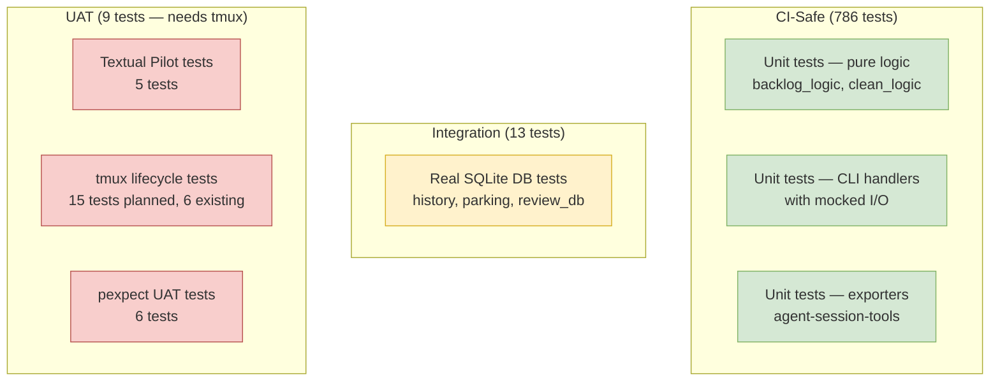

**Concern**: The UAT tests require tmux and are excluded from CI. This means tmux-related regressions won't be caught automatically.

**Recommendation**: Add a nightly CI job that runs on a macOS runner with tmux installed.

---

## 4. Package Boundaries

### 4.1 studyctl vs agent-session-tools

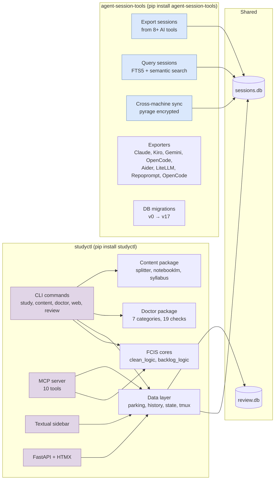

**Boundary assessment**: The package boundary is clean. `studyctl` handles the study experience, `agent-session-tools` handles session export/search/sync. They share the same SQLite database but have independent publishable lifecycles.

### 4.2 Dependency Flow

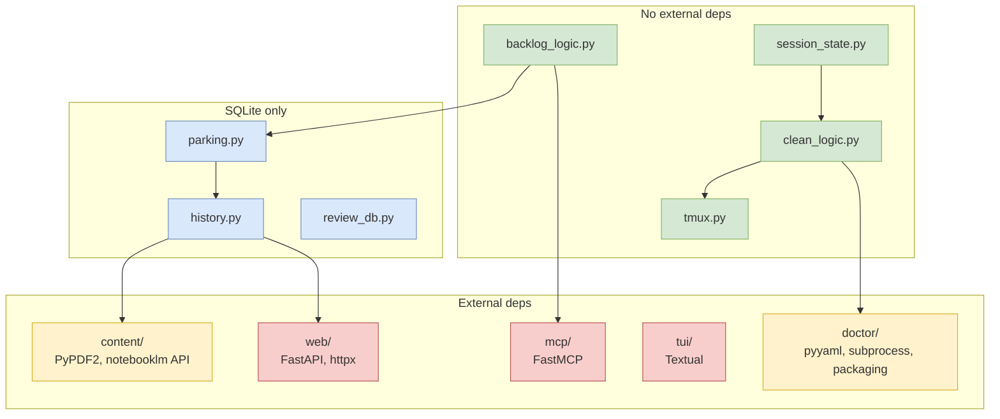

**Assessment**: Dependency flow is mostly clean. The FCIS cores have zero external dependencies, which is excellent. The web and TUI layers are the heaviest (as expected).

---

## 5. Code Quality Observations

### 5.1 Strengths

- **FCIS pattern is the best thing in this codebase** — pure functions with zero-mock tests are the gold standard
- **Test pyramid is well-structured** — 786 CI-safe tests, 13 integration, 9 UAT
- **Agent framework unification** — `agents/shared/` eliminated ~700 lines of duplication
- **Web router separation** — proper `web/routes/` structure, unlike mailgraph
- **IPC file protocol** — simple, effective, no running server required
- **Doctor package** — 19 health checks across 7 categories, `--json` output for AI agents
- **Compaction discipline** — roadmap shows clear focus after stripping bloat
- **Documentation is exceptional** — architecture docs, brainstorms, mentoring, solutions all well-organized
- **Migration system** — v0 to v17 with proper versioning
- **Homebrew tap + PyPI** — professional distribution

### 5.2 Concerns

| Concern | Severity | Location | Description |
|---------|----------|----------|-------------|
| `_clean_logic.py` in `cli/` | **Medium** | `cli/_clean_logic.py` | FCIS core should not be in CLI package |
| Two config systems | **Medium** | `settings.py` vs `config_loader.py` | YAML vs JSON, different paths |
| Service layer incomplete | **Medium** | `services/review.py` | Not all consumers use it |
| UAT tests excluded from CI | **Medium** | `tests/test_tmux.py`, `test_uat_terminal.py` | tmux regressions not caught |
| SSE via mtime polling | **Low** | `web/routes/session.py` | 500ms latency, acceptable for now |
| Two SQLite databases | **Low** | `sessions.db` + `review.db` | Intentional separation, but limits cross-queries |
| VSCode circular import | **Low** | `integrations/vscode.py` | Known issue, not fixed |
| `query_sessions.py` monolith | **Low** | `agent-session-tools/query_sessions.py` | Roadmap item to split into CLI/formatters/resolver |

---

## 6. Data Flow — Session Lifecycle

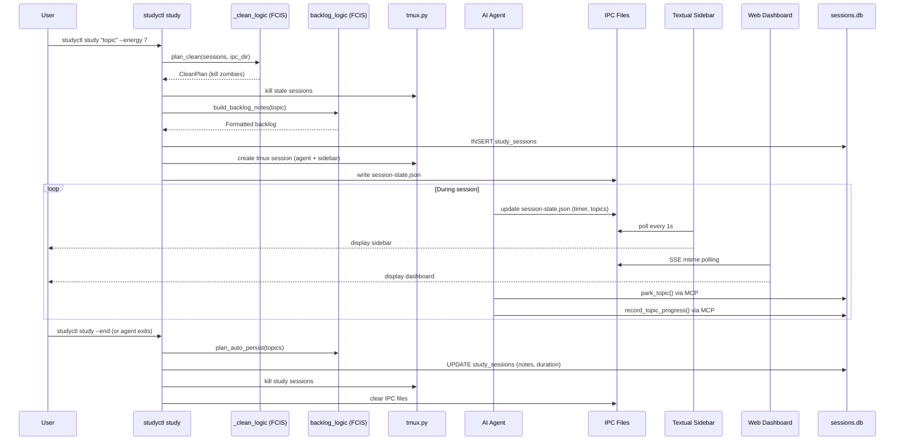

---

## 7. Comparison with mailgraph

| Dimension | mailgraph | socratic-study-mentor | Winner |
|-----------|-----------|----------------------|--------|
| **Layer boundaries** | Violated (query→api) | Clean (FCIS pattern) | **study-mentor** |
| **Route organization** | Monolith (676 lines) | Proper routers | **study-mentor** |
| **Test strategy** | 407 tests, missing API/E2E | 799+ tests, 3 tiers | **study-mentor** |
| **FCIS pattern** | Not used | Consistently applied | **study-mentor** |
| **Service layer** | Incomplete migration | Partially wired | **Tie** |
| **Documentation** | Exceptional (1274 lines current-state) | Exceptional (multiple architecture docs) | **Tie** |
| **Distribution** | uv tool install only | PyPI + Homebrew | **study-mentor** |
| **Config management** | Single TOML | Two systems (YAML + JSON) | **mailgraph** |
| **Multi-database** | SQLite + PG + Neo4j | SQLite + SQLite (review.db) | **mailgraph** (more capable) |
| **Agent support** | MCP server only | 4 platforms + shared framework | **study-mentor** |

---

## 8. Recommendations — Priority Order

### P0: Move `_clean_logic.py` Out of `cli/`

**Why**: FCIS core shouldn't be in the CLI package. It's a pure logic module.

**Steps**:
1. Create `studyctl/logic/` package
2. Move `_clean_logic.py` → `logic/clean_logic.py` (drop underscore)
3. Move `backlog_logic.py` → `logic/backlog_logic.py` (already at top level, move into package)
4. Update imports in `cli/_clean.py`, `cli/_topics.py`, `cli/_study.py`, `mcp/tools.py`
5. Run full test suite to verify

**Estimated effort**: 0.5 days

### P0: Wire Service Layer Completely

**Why**: `services/review.py` exists but `cli/_review.py` and `routes/cards.py` bypass it.

**Steps**:
1. Move all review_db access patterns into `services/review.py`
2. Update `cli/_review.py` to import from `services/review.py`
3. Update `routes/cards.py` to import from `services/review.py`
4. Add tests for `services/review.py` (currently missing)

**Estimated effort**: 1 day

### P1: Unify Config Systems

**Why**: Two config systems (YAML + JSON) in same monorepo is confusing.

**Steps**:
1. Migrate `agent-session-tools/config_loader.py` to use YAML format
2. Consolidate config path to `~/.config/studyctl/config.yaml`
3. Add migration script for existing JSON configs
4. Update documentation

**Estimated effort**: 1 day

### P1: Add Nightly CI for UAT Tests

**Why**: tmux-related regressions not caught in CI.

**Steps**:
1. Add GitHub Actions workflow: `nightly-uat.yml`
2. Run on macOS runner with tmux installed
3. Execute `pytest -m integration` only
4. Notify on failure

**Estimated effort**: 0.5 days

### P2: Split `query_sessions.py` Monolith

**Why**: Roadmap item — currently does CLI, formatting, and resolution in one file.

**Steps**:
1. Extract `formatters.py` (output formatting)
2. Extract `resolver.py` (query resolution logic)
3. Keep `query_sessions.py` as CLI entry point
4. Update tests

**Estimated effort**: 1 day

### P3: Fix VSCode Circular Import

**Why**: Known issue blocking VSCode integration.

**Steps**:
1. Analyze import cycle in `integrations/vscode.py`
2. Break cycle with lazy import or restructure
3. Add test

**Estimated effort**: 0.5 days

---

## 9. Documentation Health

| Document | Status | Accuracy | Action |
|----------|--------|----------|--------|
| `docs/architecture/system-overview.md` | Current | High | Keep updating |
| `docs/roadmap.md` | Current | High | Keep updating |
| `docs/setup-guide.md` | Current | High | Keep updating |
| `docs/session-protocol.md` | Current | High | Keep updating |
| `docs/architecture/study-backlog-phase1.md` | Historical | Medium | Mark as completed |
| `docs/architecture/study-backlog-phase2.md` | Historical | Medium | Mark as completed |
| `docs/TESTING.md` | Current | High | Keep updating |
| `docs/cli-reference.md` | Current | High | Keep updating |

**Recommendation**: Add a `docs/HISTORICAL.md` index that clearly marks which documents are historical vs current, similar to mailgraph.

---

## 10. Summary Scorecard

| Dimension | Score | Notes |
|-----------|-------|-------|
| **Functionality** | 9/10 | 4 core features working, v2.2 polish pending |
| **Architecture** | 8/10 | FCIS pattern, clean package boundaries, proper routers |
| **Code Quality** | 8/10 | Pure functions, zero-mock tests, consistent patterns |
| **Test Coverage** | 9/10 | 799+ tests, 3 tiers, but UAT excluded from CI |
| **Documentation** | 9/10 | Exceptional, well-organized, some historical docs |
| **Performance** | 8/10 | SSE via mtime polling (acceptable), no major bottlenecks |
| **Security** | 8/10 | pyrage encryption, proper file permissions (0700/0600) |
| **Maintainability** | 8/10 | FCIS pattern makes changes easy, service layer incomplete |

**Overall: 8.4/10** — A well-architected, mature project with strong foundations. The FCIS pattern is exemplary. Remaining issues are polish items, not structural problems.

---

## 11. Key Takeaway

The FCIS (Functional Core, Imperative Shell) pattern is the standout architectural decision in this codebase. It produces:
- **Zero-mock tests** — pure functions that take data and return data
- **Easy reasoning** — no side effects to track
- **Composable logic** — functions can be combined without I/O concerns

This is the pattern that mailgraph should adopt. The contrast between the two repos is instructive: mailgraph has layer violations and a monolithic app.py, while study-mentor has clean boundaries and testable cores.
